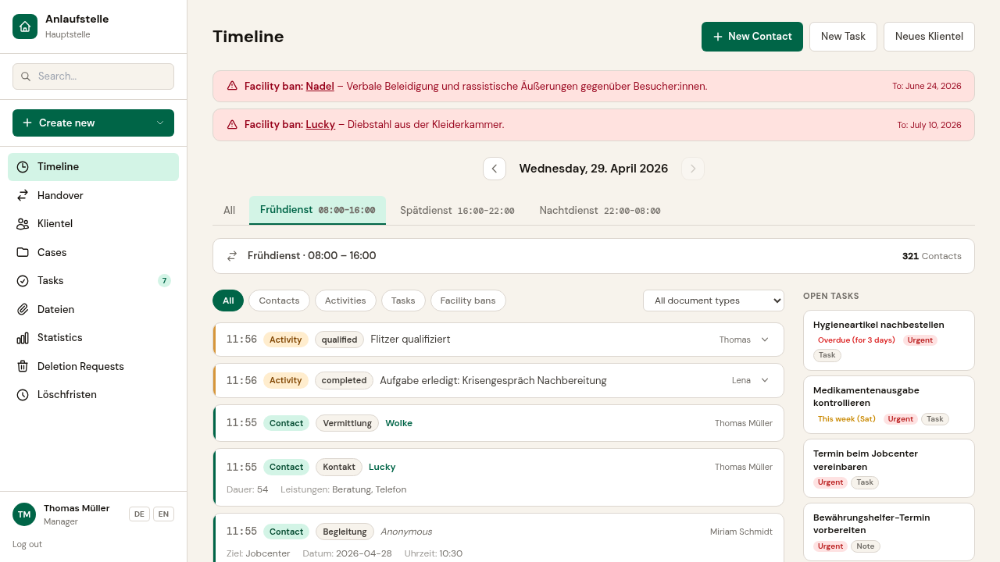
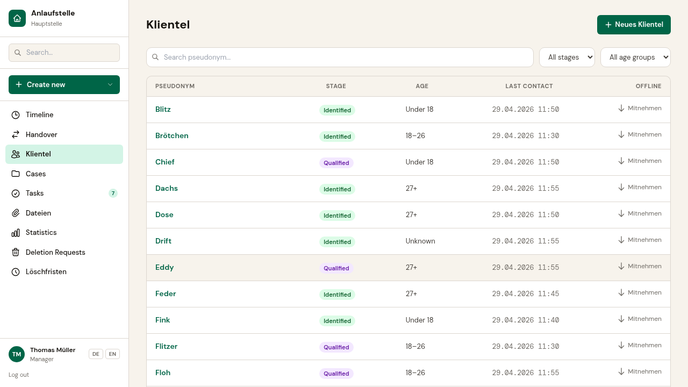
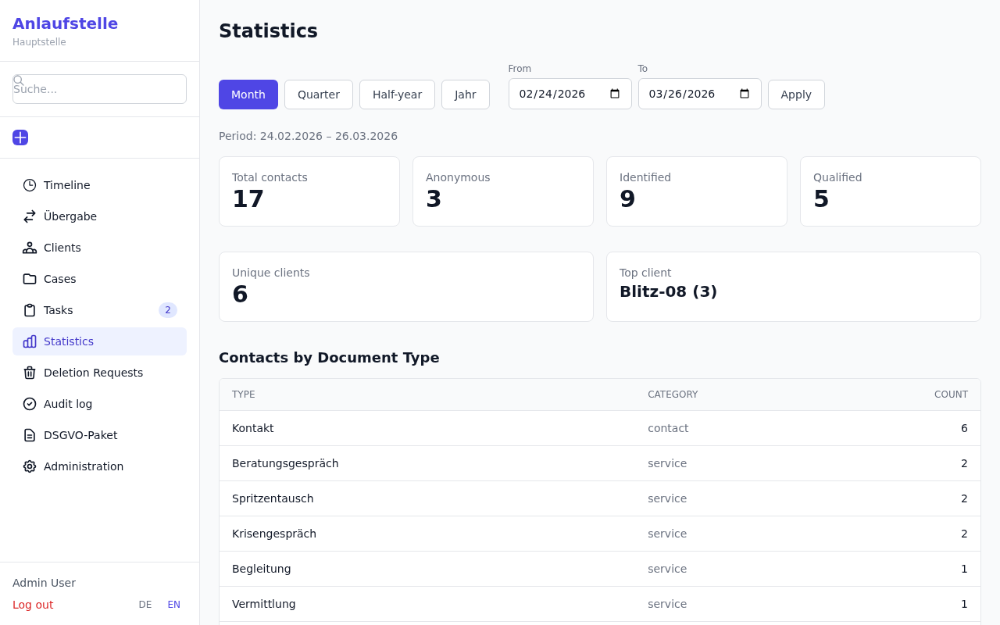
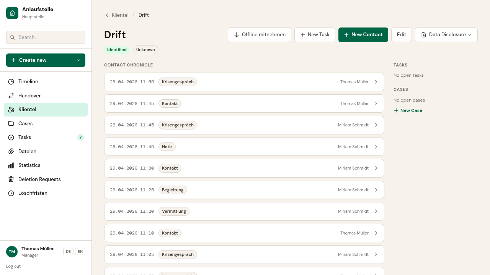
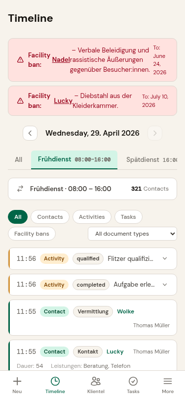

> **[Deutsche Version / German version](README.md)**

# Anlaufstelle

**Documentation, statistics, and team communication for drop-in centers, shelters, and street outreach — open source, GDPR-compliant, pseudonymized, free.**

> ⚠️ **Pre-Release (v0.12.0)** — Anlaufstelle is functional but not yet cleared for production use. Quality assurance and stabilization are ongoing. We are looking for pilot facilities to test and co-develop the system — [get in touch](mailto:kontakt@anlaufstelle.app).

---

## What Anlaufstelle looks like

| Timeline — your digital logbook | Client list |
|:---:|:---:|
|  |  |

| Statistics at the push of a button | Client history |
|:---:|:---:|
|  |  |

<details>
<summary>Mobile view</summary>

| Timeline (Mobile) |
|:---:|
|  |

</details>

---

## Who is Anlaufstelle for?

Anlaufstelle is built for facilities where most contacts are anonymous or pseudonymous:

- **Drop-in centers** — low-threshold addiction services
- **Emergency shelters** — homelessness support
- **Street outreach teams** — mobile social work
- **Day centers and day shelters**
- **Supervised consumption rooms and low-threshold counseling**

Typical team size: 5–20 staff. Typical situation: documentation with logbooks, tally sheets, and spreadsheets — because suitable software is either too expensive, too complex, or not designed for anonymous contacts.

---

## What is Anlaufstelle?

Anlaufstelle is software for the daily work in low-threshold social services. It supports your team with documentation, information sharing between shifts, and the creation of reports and statistics — without requiring clients to provide their legal name.

Established commercial social-sector software targets large organizations, is prohibitively expensive for small facilities, and requires every person to be registered with their full name and address. Anlaufstelle fills this gap: low-threshold, affordable, and privacy-compliant.

---

## Three reasons to choose Anlaufstelle

### 1. No real names — by design

There is no name field. Your clients are recorded under a pseudonym assigned by your team. The system supports three contact levels:

- **Anonymous** — no pseudonym, no re-identification (e.g. brief visits, needle exchange)
- **Identified** — pseudonym assigned, person is recognizable on return
- **Qualified** — additional details recorded (e.g. age group, district)

No real name ever enters the database — neither accidentally nor intentionally.

### 2. Timeline documentation — like your logbook, but digital

The start page shows what happened most recently — just like opening the logbook at the beginning of a shift. Every contact, observation, and service is recorded as an entry in the timeline.

You can define time periods to match your operations — e.g. "Night shift 21:30–09:00" or "Morning" — and generate reports and statistics aligned precisely to your work rhythm.

### 3. Tailored to your facility — no programming required

Every facility works differently. Anlaufstelle adapts to your documentation practice: What types of contacts do you have? What services are recorded? What fields does an entry need?

The configuration also governs data protection:

- **Sensitivity level** — which data requires special protection
- **Encryption** — sensitive fields are encrypted individually
- **Retention period** — automatic deletion after a defined period
- **Statistics mapping** — which fields feed into reports

---

## What Anlaufstelle can do

### In daily work

- **Document contacts** — in 30 seconds, including from a smartphone
- **Notes and tasks** — share information between shifts, track follow-ups
- **Client registry** — pseudonyms, contact levels, history timeline
- **Typo-tolerant search** — quickly find what you need
- **Offline mode for streetwork** — capture entries without network, encrypted on-device
- **German and English** — language switcher built in

### For management

- **Statistics and reports** — analysis at the push of a button, export as CSV and PDF
- **Youth welfare report** — pre-formatted and ready to submit
- **4-tier role model** — Admin, Lead, Staff, Assistant
- **Facility isolation** — data is fully separated, no mixing between locations

### Data protection and GDPR

Anlaufstelle is designed from the ground up for handling particularly sensitive data (Art. 9 GDPR):

- **Pseudonymization** — no name field in the database (Art. 25 GDPR, Privacy by Design)
- **Field encryption** — sensitive data encrypted per field with AES-128 (Art. 32 GDPR)
- **Encrypted file attachments** — file vault with AES-GCM and ClamAV virus scanning before storage
- **Two-factor authentication** — TOTP with backup codes, can be enforced facility-wide
- **Retention periods** — automatic deletion after configurable period (Art. 17 GDPR)
- **Deletion requests with four-eyes principle** — deletion only after approval by management/admin
- **Audit trail** — immutable log of all security-relevant actions
- **Data subject rights** — data access and export for clients (Art. 15, 20 GDPR)
- **GDPR templates** — sample documents for DPA, DPIA, TOMs, records of processing, and privacy notices included

---

## Support for getting started

Anlaufstelle is open source and free to use. If you need help introducing the system in your facility, the makers of Anlaufstelle offer professional support:

- **Consulting** — from needs assessment and documentation concepts to system setup
- **Training** — team training via video conference or on-site
- **Customization** — configuration of documentation types for your facility

**Initial consultation (30 minutes) free of charge.** Contact: [kontakt@anlaufstelle.app](mailto:kontakt@anlaufstelle.app)

---

## Documentation

User manual, admin manual, and domain concept are available in the [docs/](docs/) directory.

---

## License

Anlaufstelle is licensed under the [GNU Affero General Public License v3.0](LICENSE).

This means: the source code is free to use, modify, and redistribute — even when operated as a web service, the source code must be made available. This ensures the application remains permanently accessible to all facilities.

### Disclaimer

Anlaufstelle is provided "as is", without warranty of any kind (see [LICENSE](LICENSE), Sections 15-16). The software and its documentation do **not constitute legal advice**. Operators are solely responsible for compliance with data protection regulations (GDPR, SGB X) — in particular for data protection impact assessments, data processing agreements, and organizational measures.

---

## Development

This project uses generative AI as an integral part of the development process — as a pair programming partner, research assistant, and architecture sparring partner. The AI works under human direction. The team is responsible for concept, architecture, and outcome.

The domain foundation is based on a diploma thesis on documentation in low-threshold addiction care and years of hands-on experience in social work — not on AI generation.

---

## Contributing

Contributions are welcome. Please read the [contributing guidelines](CONTRIBUTING.md) before opening a pull request.

Report bugs and share ideas: [GitHub Issues](https://github.com/anlaufstelle/app/issues)

---

<details>
<summary><strong>For developers</strong></summary>

### Quick Start

**Prerequisites:** Docker and Docker Compose

```bash
git clone https://github.com/anlaufstelle/app.git
cd anlaufstelle
docker compose up
```

Open the application at: [http://localhost:8000](http://localhost:8000)

On first launch, database migrations run automatically. Seed data for a demo facility can be loaded with:

```bash
docker compose exec web python src/manage.py seed
```

### Tech Stack

| Component | Technology |
|---|---|
| Backend | Django 5.1+, Python 3.13 |
| Frontend | HTMX + Alpine.js + Tailwind CSS |
| Database | PostgreSQL 16 |
| Encryption | Fernet / AES-128 |
| Deployment | Docker Compose |
| Tests | pytest + Playwright (E2E) |
| Linting | ruff |
| CI/CD | GitHub Actions |

</details>

<!-- translation-source: README.md -->
<!-- translation-version: v0.12.0 -->
<!-- translation-date: 2026-05-12 -->
