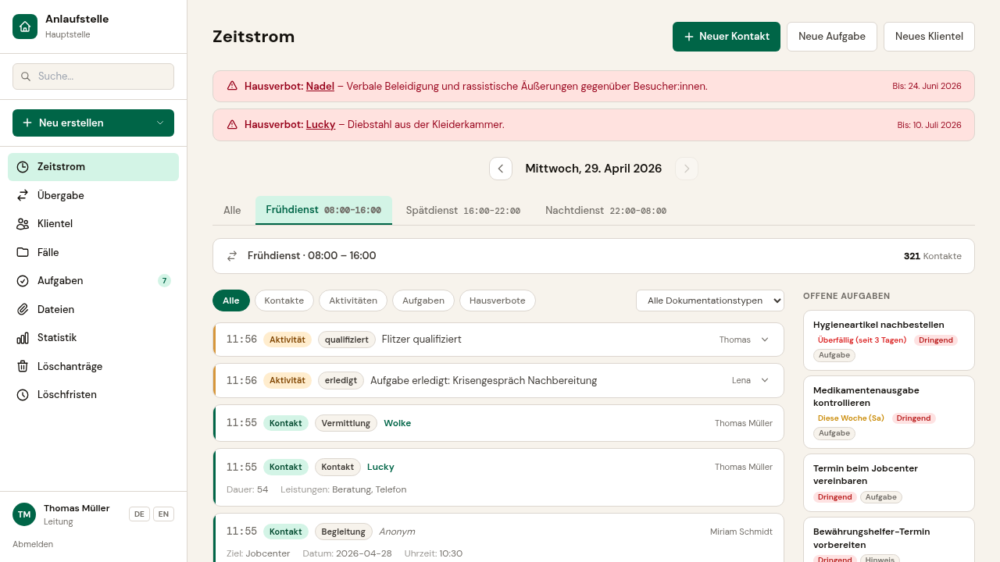
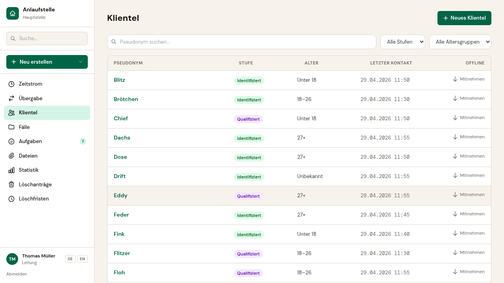
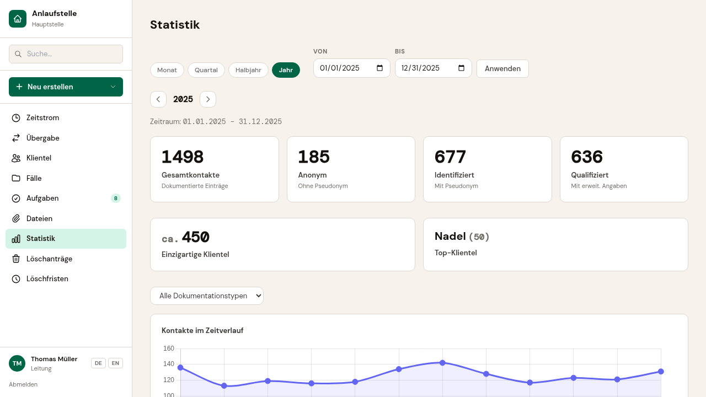
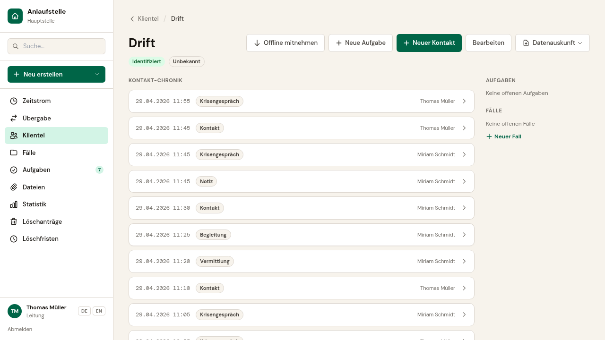
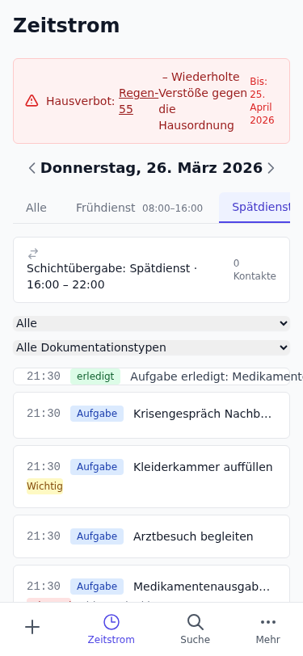

> **[English version / Englische Version](README.en.md)**

# Anlaufstelle

**Dokumentation, Statistik und Teamkommunikation für Kontaktläden, Notschlafstellen und Streetwork — Open Source, DSGVO-konform, pseudonymisiert, kostenlos.**

> ⚠️ **Pre-Release (v0.11.0)** — Anlaufstelle ist funktionsfähig, aber noch nicht für den Produktiveinsatz freigegeben. Qualitätssicherung und Stabilisierung laufen. Wir suchen Piloteinrichtungen, die das System gemeinsam mit uns testen und weiterentwickeln möchten — [Kontakt aufnehmen](mailto:kontakt@anlaufstelle.app).

---

## So sieht Anlaufstelle aus

| Zeitstrom — Ihr digitales Dienstbuch | Personenliste |
|:---:|:---:|
|  |  |

| Statistiken auf Knopfdruck | Personenverlauf |
|:---:|:---:|
|  |  |

<details>
<summary>Mobile Ansicht</summary>

| Zeitstrom (Mobil) |
|:---:|
|  |

</details>

---

## Für wen ist Anlaufstelle?

Anlaufstelle richtet sich an Einrichtungen, in denen die Mehrzahl der Kontakte anonym oder pseudonym ist:

- **Kontaktläden und Kontaktcafés** — niedrigschwellige Suchthilfe
- **Notschlafstellen** — Wohnungslosenhilfe
- **Streetwork-Teams** — mobile soziale Arbeit
- **Tagesaufenthalte und Tagesstätten**
- **Konsumräume und niedrigschwellige Beratungsstellen**

Typische Teamgröße: 5–20 Mitarbeitende. Typische Situation: Dokumentation mit Kladden, Zählblättern und Excel — weil passende Software entweder zu teuer, zu komplex oder nicht auf anonyme Kontakte ausgelegt ist.

---

## Was ist Anlaufstelle?

Anlaufstelle ist eine Software für die tägliche Arbeit in der niedrigschwelligen Sozialarbeit. Sie unterstützt Ihr Team bei der Dokumentation, der Informationsweitergabe zwischen Diensten und der Erstellung von Berichten und Statistiken — ohne dass Personen einen bürgerlichen Namen angeben müssen.

Etablierte kommerzielle Sozialbereichssoftware richtet sich an große Träger, ist für kleine Einrichtungen zu teuer und setzt voraus, dass jede Person mit Name und Adresse erfasst wird. Anlaufstelle füllt diese Lücke: niedrigschwellig, finanzierbar, datenschutzgerecht.

---

## Drei Gründe für Anlaufstelle

### 1. Ohne Klarnamen — von Anfang an

Es gibt kein Namensfeld. Personen werden unter einem Pseudonym geführt, das Ihr Team vergibt. Das System kennt drei Kontaktstufen:

- **Anonym** — kein Pseudonym, keine Wiedererkennung (z. B. Kurzbesuche, Spritzentausch)
- **Identifiziert** — Pseudonym vergeben, Person ist wiedererkennbar
- **Qualifiziert** — weitergehende Angaben (z. B. Altersgruppe, Bezirk)

Kein Klartextname gelangt in die Datenbank — weder versehentlich noch absichtlich.

### 2. Dokumentation im Zeitstrom — wie Ihr Dienstbuch, nur digital

Die Startseite zeigt, was zuletzt passiert ist — genau wie ein Blick in die Kladde bei Dienstbeginn. Jeder Kontakt, jede Beobachtung, jede Leistung wird als Eintrag im Zeitstrom festgehalten.

Sie können Zeiträume passend zu Ihrem Betrieb definieren — z. B. „Nachtdienst 21:30–09:00" oder „Vormittag" — und Berichte und Statistiken exakt auf Ihren Arbeitsrhythmus zuschneiden.

### 3. Passend für Ihre Einrichtung — ohne Programmierung

Jede Einrichtung arbeitet anders. Anlaufstelle lässt sich an Ihre Dokumentationspraxis anpassen: Welche Kontaktarten gibt es? Welche Leistungen werden erfasst? Welche Felder braucht ein Eintrag?

Die Konfiguration bestimmt auch den Datenschutz:

- **Sensibilitätsstufe** — welche Angaben besonders schützenswürdig sind
- **Verschlüsselung** — sensible Felder werden einzeln verschlüsselt gespeichert
- **Aufbewahrungsfrist** — automatische Löschung nach einer festgelegten Frist
- **Statistikzuordnung** — welche Felder in Berichte einfließen

---

## Was Anlaufstelle kann

### Im Arbeitsalltag

- **Kontakte dokumentieren** — in 30 Sekunden, auch vom Smartphone
- **Hinweise und Aufgaben** — Informationen zwischen Diensten weitergeben, Aufgaben nachverfolgen
- **Personen-Register** — Pseudonyme, Kontaktstufen, Verlaufschronik
- **Tippfehler-tolerante Suche** — schnell finden, was Sie suchen
- **Offline-Modus für Streetwork** — Erfassung auch ohne Netz, lokal verschlüsselt
- **Deutsch und Englisch** — Sprachumschaltung im System

### Für Leitung und Träger

- **Statistiken und Berichte** — Auswertungen auf Knopfdruck, Export als CSV und PDF
- **Jugendamtsbericht** — fertig formatiert
- **4-Stufen-Rollenmodell** — Admin, Leitung, Fachkraft, Assistenz
- **Einrichtungstrennung** — Daten sind vollständig getrennt, kein Datenmix zwischen Standorten

### Datenschutz und DSGVO

Anlaufstelle ist von Grund auf für den Umgang mit besonders schützenswerten Daten (Art. 9 DSGVO) konzipiert:

- **Pseudonymisierung** — kein Namensfeld in der Datenbank (Art. 25 DSGVO, Privacy by Design)
- **Feldverschlüsselung** — sensible Angaben werden einzeln mit AES-128 verschlüsselt (Art. 32 DSGVO)
- **Verschlüsselte Dateianhänge** — File Vault mit AES-GCM und ClamAV-Virenscan vor der Ablage
- **Zwei-Faktor-Authentifizierung** — TOTP mit Backup-Codes, einrichtungsweite Erzwingung möglich
- **Aufbewahrungsfristen** — automatische Löschung nach konfigurierbarer Frist (Art. 17 DSGVO)
- **Löschanträge mit 4-Augen-Prinzip** — Löschung nur nach Genehmigung durch Leitung/Admin
- **Prüfprotokoll** — unveränderliches Audit-Log aller sicherheitsrelevanten Aktionen
- **Betroffenenrechte** — Datenauskunft und -export für Personen (Art. 15, 20 DSGVO)
- **DSGVO-Vorlagen** — Muster für AV-Vertrag, DSFA, TOMs, Verarbeitungsverzeichnis und Informationspflichten mitgeliefert

---

## Unterstützung bei der Einführung

Anlaufstelle ist Open Source und kostenlos nutzbar. Wenn Sie Hilfe bei der Einführung in Ihrer Einrichtung benötigen, bieten die Macher von Anlaufstelle professionelle Unterstützung an:

- **Beratung** — von der Bedarfsanalyse über Dokumentationskonzepte bis zur Einrichtung des Systems
- **Schulung** — Teamschulungen per Videokonferenz oder vor Ort
- **Anpassung** — Konfiguration der Dokumentationstypen für Ihre Einrichtung

**Erstgespräch (30 Minuten) kostenlos.** Kontakt: [kontakt@anlaufstelle.app](mailto:kontakt@anlaufstelle.app)

---

## Dokumentation

Benutzerhandbuch, Admin-Handbuch und Fachkonzept finden Sie im [docs/](docs/)-Verzeichnis.

---

## Lizenz

Anlaufstelle steht unter der [GNU Affero General Public License v3.0](LICENSE).

Das bedeutet: Der Quellcode ist frei nutzbar, veränderbar und weiterzugeben — auch für den Betrieb als Webdienst muss der Quellcode offengelegt werden. Damit bleibt die Anwendung dauerhaft für alle Einrichtungen zugänglich.

### Haftungsausschluss

Anlaufstelle wird ohne Mängelgewähr bereitgestellt, ohne Gewährleistung jeglicher Art (siehe [LICENSE](LICENSE), §15–16). Die Software und ihre Dokumentation stellen **keine Rechtsberatung** dar. Betreiber sind eigenverantwortlich für die Einhaltung datenschutzrechtlicher Pflichten (DSGVO, SGB X) — insbesondere für Datenschutz-Folgenabschätzung, Auftragsverarbeitungsverträge und organisatorische Maßnahmen.

---

## Entwicklung

Dieses Projekt nutzt generative AI als integralen Bestandteil des Entwicklungsprozesses — als Pair-Programming-Partner, Research-Assistent und Architektur-Sparringspartner. Die AI arbeitet unter menschlicher Anleitung. Das Team verantwortet Konzept, Architektur und Ergebnis.

Das fachliche Fundament basiert auf einer Diplomarbeit zur Dokumentation in der niedrigschwelligen Suchthilfe und jahrelanger Praxiserfahrung in der Sozialen Arbeit — nicht auf AI-Generierung.

---

## Mitwirken

Beiträge sind willkommen. Bitte lies zuerst die [Contributing-Richtlinien](CONTRIBUTING.md), bevor du einen Pull Request öffnest.

Fehler melden und Ideen einbringen: [GitHub Issues](https://github.com/anlaufstelle/app/issues)

---

<details>
<summary><strong>Für Entwickler</strong></summary>

### Quick-Start

**Voraussetzungen:** Docker und Docker Compose

```bash
git clone https://github.com/anlaufstelle/app.git
cd app
docker compose up
```

Anwendung aufrufen: [http://localhost:8000](http://localhost:8000)

Beim ersten Start werden Datenbank-Migrationen automatisch ausgeführt. Seed-Daten für eine Demo-Einrichtung können mit folgendem Befehl geladen werden:

```bash
docker compose exec web python src/manage.py seed
```

### Tech-Stack

| Komponente | Technologie |
|---|---|
| Backend | Django 5.1+, Python 3.13 |
| Frontend | HTMX + Alpine.js + Tailwind CSS |
| Datenbank | PostgreSQL 16 |
| Verschlüsselung | Fernet / AES-128 |
| Deployment | Docker Compose |
| Tests | pytest + Playwright (E2E) |
| Linting | ruff |
| CI/CD | GitHub Actions |

</details>
