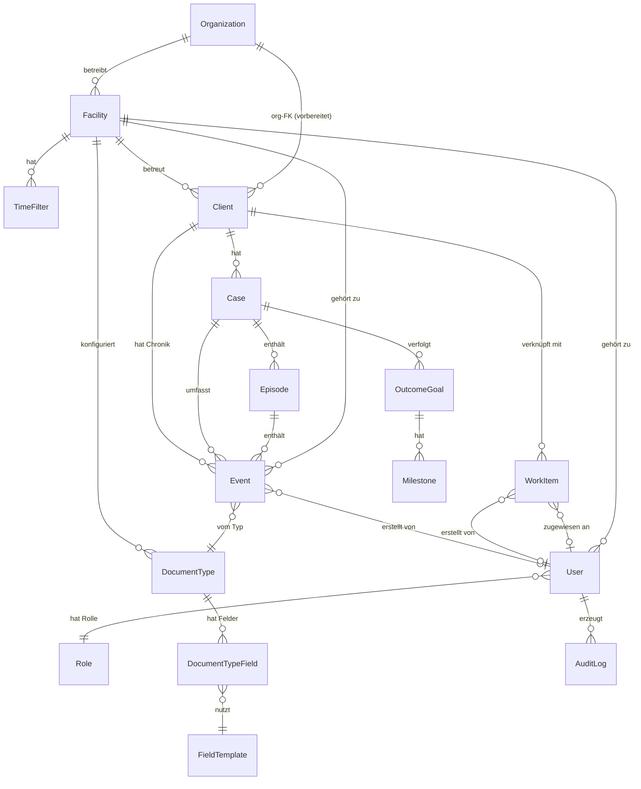

# Fachkonzept Anlaufstelle

**Open-Source-Fachsystem für niedrigschwellige soziale Arbeit**

Autor: Barbara Nix, Tobias Nix
Stand: April 2026
Version: 1.4

---

### Änderungshistorie

| Version | Datum | Änderungen |
|---|---|---|
| 1.0 | Dezember 2025 | Erstfassung |
| 1.1 | Februar 2026 | Schichtkonzept durch benannte Zeitfilter ersetzt. Übergabe-Konzept aufgelöst — abgedeckt durch Arbeitsinfos (Hinweise, Aufgaben). Organisationshierarchie als offene Entscheidung markiert. |
| 1.2 | März 2026 | Alle offenen Entscheidungen geschlossen: Organisationshierarchie (Option 2: Klein + vorbereitet), JSONB (bedingt entschieden für Phase 1–3), Lizenz (AGPL v3). Phasenplan: Phase 1 gesplittet in 1a (zeigbarer Kern) und 1b (Fundament komplett). |
| 1.3 | April 2026 | Feld-Level-Sensitivität: Verschlüsselung und Sichtbarkeit entkoppelt (`FieldTemplate.sensitivity`). |
| 1.4 | April 2026 (2026-04-19) | Mobile-/Offline-Strategie (§ 16) auf Ist-Stand v0.10 aktualisiert; Sicherheitskonzept um 2FA, File Vault, RLS erweitert. |

---

## Inhaltsverzeichnis

**Teil I: Fachlich-Strategisch**

1. [Produktvision & Positionierung](#1-produktvision--positionierung)
2. [Ausgangslage & Problemanalyse](#2-ausgangslage--problemanalyse)
3. [Zielgruppen](#3-zielgruppen)
4. [Produktprinzipien](#4-produktprinzipien)
5. [Nutzungsperspektive & Praxisszenarien](#5-nutzungsperspektive--praxisszenarien)
6. [Fachliche Kernkonzepte](#6-fachliche-kernkonzepte)
7. [Modulstruktur](#7-modulstruktur)
8. [Phasenplan](#8-phasenplan)

**Teil II: Architektur & Domäne**

9. [Domänenmodell](#9-domänenmodell)
10. [Architekturentscheidungen](#10-architekturentscheidungen)
11. [Fachliche Domänenbibliothek](#11-fachliche-domänenbibliothek)
12. [Open-Source-Strategie](#12-open-source-strategie)
13. [Bewusste Abgrenzungen](#13-bewusste-abgrenzungen)
14. [Glossar](#14-glossar)

**Teil III: Ergänzungen**

15. [Technologie-Referenzarchitektur](#15-technologie-referenzarchitektur)
16. [Mobile- und Offline-Strategie](#16-mobile--und-offline-strategie)
17. [Nicht-funktionale Anforderungen](#17-nicht-funktionale-anforderungen)
18. [JSONB-Performance-Monitoring (vor Auswertungs-Roadmap)](#18-jsonb-performance-monitoring-vor-auswertungs-roadmap)
19. [Datenschutz: Phasenabgrenzung](#19-datenschutz-phasenabgrenzung)
20. [Barrierefreiheit](#20-barrierefreiheit)
21. [Internationalisierung und Sprache](#21-internationalisierung-und-sprache)
22. [Regulatorische Landschaft](#22-regulatorische-landschaft)
23. [Nachhaltigkeitsstrategie](#23-nachhaltigkeitsstrategie)
24. [Validierung des 30-Sekunden-Ziels](#24-validierung-des-30-sekunden-ziels)
25. [Administration und Betrieb](#25-administration-und-betrieb)
26. [Entscheidungsübersicht](#26-entscheidungsübersicht)

---

# Teil I: Fachlich-Strategisch

---

## 1. Produktvision & Positionierung

Anlaufstelle ist ein Open-Source-Fachsystem für die Dokumentation, operative Steuerung und Wirkungsmessung in niedrigschwelligen sozialen Einrichtungen. Es richtet sich an Kontaktläden, Notschlafstellen, Streetwork-Teams und vergleichbare Angebote der Sucht- und Wohnungslosenhilfe, die heute mit Papier, Excel und Kladden arbeiten — weil keine bezahlbare, passende Software existiert.

### Strategischer Schwenk

Das Projekt entstand 2009 als Konzept für ein Dokumentationssystem speziell für Kontaktläden (Diplomarbeit „Möglichkeiten und Grenzen von Management Software in sozialen Einrichtungen", FH Düsseldorf). Ein erster Prototyp wurde 2026 auf Basis der damaligen Ideen als Webanwendung realisiert. Aus der Arbeit am Prototyp und der Auseinandersetzung mit dem Feld hat sich eine größere Ambition entwickelt: Anlaufstelle soll nicht nur ein Dokumentationswerkzeug sein, sondern ein fachlich fundiertes, konzeptionell durchdachtes Produkt — ein Open-Source-Fachsystem, das die Arbeitsrealität niedrigschwelliger Einrichtungen ernst nimmt und auf Augenhöhe mit kommerzieller Fachsoftware steht, ohne deren Kosten und Komplexität mitzubringen.

### Positionierung

Anlaufstelle ist das Fachsystem, das die Lücke zwischen teurer Großträger-Software und selbstgebastelten Excel-Tabellen schließt — indem es Pseudonymisierung, Kontaktstufen und die Arbeitsrealität niedrigschwelliger Einrichtungen als Kernkonzepte behandelt, nicht als optionale Erweiterungen.

### Abgrenzung zu bestehender Fachsoftware

Der Markt für Fachsoftware im Sozialbereich bedient drei Segmente: umfassende Enterprise-Suiten für Großträger und Komplexträger, spezialisierte Fallbearbeitungssysteme für Kommunen und Jugendämter sowie mittelständische Branchenlösungen für freie Träger in der Jugendhilfe. Für niedrigschwellige Einrichtungen bleibt eine systematische Lücke:

- **Zu teuer.** Preise sind häufig nicht einmal öffentlich einsehbar. Wo sie es sind, beginnen sie bei Bereichen, die für spendenfinanzierte Einrichtungen mit 5–15 Mitarbeitenden nicht tragbar sind.
- **Zu komplex.** Wochenlange Einführungsprojekte, Consulting-Verträge und umfangreiche Schulungen setzen Ressourcen voraus, die in der Zielgruppe schlicht nicht vorhanden sind.
- **Falsche Zielgruppe.** Kein gesichtetes System — kommerziell oder Open Source — bietet Pseudonymisierung als Kernkonzept oder dreistufige Kontaktmodelle. Alle setzen eine identifizierte Person als Ausgangspunkt voraus. Das passt nicht zu einer Realität, in der die Mehrzahl der Kontakte anonym bleibt.
- **Kein Open Source.** Kein einziges der etablierten Fachsysteme im deutschen Sozialsektor ist Open Source. Das erschwert Vertrauen im Umgang mit hochsensiblen Daten vulnerabler Zielgruppen und verhindert gemeinschaftliche Weiterentwicklung.

---

## 2. Ausgangslage & Problemanalyse

### Dokumentationsrealität in niedrigschwelligen Einrichtungen

Niedrigschwellige Einrichtungen der Sucht- und Wohnungslosenhilfe — Kontaktcafés, Notschlafstellen, Streetwork-Projekte, Tagesaufenthalte — dokumentieren ihre Arbeit überwiegend analog oder mit selbstgebauten Behelfslösungen:

- **Handschriftliche Besucherlisten** an der Tür, die am Dienstende in Excel übertragen werden.
- **A4-Kladden** als Informationsbuch zwischen Diensten, in denen wichtige Informationen über Klientel, aktive Hausverbote und offene Aufgaben festgehalten werden. Diese Kladden sind nicht durchsuchbar, nicht auswertbar und nur vor Ort einsehbar.
- **Excel-Tabellen** für die Kontaktstatistik, die händisch aus den Listen und Kladden zusammengetragen werden. Der Halbjahresbericht an das Jugendamt — die zentrale Nachweispflicht — kostet die Einrichtungsleitung regelmäßig zwei bis drei Wochen Arbeit.
- **Selbstgebaute Access-Datenbanken**, erstellt von Sozialarbeiter:innen mit VHS-Kurs-Niveau-Wissen in Datenbankentwicklung, ohne Datenschutzkonzept, ohne Backup, ohne Wartung.

Diese Dokumentationsrealität ist kein Versagen der Einrichtungen. Sie ist eine rationale Antwort auf das Fehlen passender Werkzeuge.

### Warum bestehende Systeme nicht passen

Die Ursache liegt nicht in mangelnder Digitalisierungsbereitschaft, sondern in einer strukturellen Nicht-Passung zwischen dem Angebot an Fachsoftware und den Anforderungen niedrigschwelliger Arbeit:

**Kosten:** Kommerzielle Fachsysteme kalkulieren für Organisationen mit mehreren Hundert Mitarbeitenden. Niedrigschwellige Einrichtungen haben typischerweise 5–15 Mitarbeitende, eine Mischfinanzierung aus öffentlichen Mitteln und Spenden, und kein separates IT-Budget.

**Komplexität:** Etablierte Großträger- und Fallbearbeitungssysteme erfordern aufwendige Einführungsprojekte mit externer Beratung. In einer Einrichtung, in der die Leitung Nachtdienste übernimmt und der IT-Support im Trägerverband ein Halbtagsadministrator ist, fehlen dafür schlicht die Kapazitäten.

**Falsche Grundannahmen:** Jedes gesichtete System setzt als Ausgangspunkt eine identifizierte Person voraus — mit Name, Geburtsdatum, Adresse. In niedrigschwelligen Einrichtungen ist der typische Kontakt anonym. Die Klientel haben das Recht, ihren Namen nicht zu nennen. Viele Kontakte bestehen aus der Ausgabe von sterilem Spritzbesteck, einem kurzen Gespräch, einer Tasse Kaffee. Ein System, das als erstes nach einem Namen fragt, hat die Arbeitsrealität nicht verstanden.

### Spezifische Anforderungen der Zielgruppe

Aus der Arbeitsrealität ergeben sich Anforderungen, die in keinem gängigen System abgebildet sind:

**Pseudonymisierung als Grundprinzip.** Klientel werden unter einem Pseudonym geführt, das das Team vergibt. Die Zuordnung Pseudonym → reale Person existiert ausschließlich im Kopf der Mitarbeitenden. Das System kennt keinen Klarnamen. Dies ist kein Workaround, sondern fachlich gewollt und datenschutzrechtlich geboten.

**Flexible Arbeitszeitmodelle.** Niedrigschwellige Einrichtungen arbeiten in unterschiedlichen Zeitstrukturen: Nachtcafés im Schichtbetrieb (21:30–09:00), Beratungsangebote in Bürozeiten (09:00–17:00), Streetwork in flexiblen Einsatzzeiten. Das System muss alle Modelle unterstützen, ohne eines davon vorauszusetzen. Die Frage „Was ist zuletzt passiert?" bezieht sich auf einen Arbeitszeitraum — ob das eine Nachtschicht oder ein Bürotag ist, bestimmt die Einrichtung.

**Niedrige IT-Ausstattung.** Ein gemeinsam genutzter Desktop-PC im Büro, vielleicht ein Laptop in der Küche, private Smartphones der Mitarbeitenden. Kein Server vor Ort, kein Netzwerkadministrator, kein stabiles WLAN in jedem Raum.

**Extreme Einfachheit.** Das System konkurriert mit einer Kladde und einem Kugelschreiber. Wenn die digitale Erfassung eines Kontakts länger dauert als der handschriftliche Eintrag, wird das System nicht genutzt. Erlernbar in zwei bis drei Stunden ist die Anforderung.

### Die Diplomarbeit als empirische Grundlage

Die Diplomarbeit „Möglichkeiten und Grenzen von Management Software in sozialen Einrichtungen" (FH Düsseldorf, 2009) untersuchte die Dokumentationspraxis am Beispiel der Einrichtung „Knackpunkt" in Düsseldorf — einem Kontaktladen für drogengebrauchende Menschen. Die Arbeit umfasste Interviews mit der Einrichtungsleitung, hauptamtlichen Mitarbeitenden und einem Datenbankentwickler, eine Analyse bestehender Dokumentationssysteme sowie den Entwurf eines Datenmodells und UI-Konzepts.

Die zentralen Erkenntnisse von 2009 haben sich als erstaunlich stabil erwiesen:

- Das Informationsbuch (Kladde) ist das wichtigste Arbeitsinstrument — aber es ist nicht durchsuchbar, nicht auswertbar und nur vor Ort verfügbar.
- Die Klientel ist formal anonym. Ein System muss ohne Klarnamen funktionieren.
- Frei konfigurierbare Dokumentationstypen sind notwendig, weil jede Einrichtung eigene Leistungen und Kategorien hat.
- Einrichtungsübergreifender Datenaustausch innerhalb eines Trägers fehlt, selbst wenn die Einrichtungen zum selben Verband gehören.
- Die IT-Kompetenzlücke ist real: „Man sollte einen IT-Spezialisten beauftragen. Sozialarbeiter sollen Sozialarbeit machen."

Was 2009 fehlte und heute essenziell ist: DSGVO-Konformität, mobile Nutzung (Streetwork), Berechtigungsmodell, Mandantenfähigkeit, Verschlüsselung und API-Schnittstellen.

---

## 3. Zielgruppen

### Primäre Zielgruppe: Niedrigschwellige Einrichtungen

Anlaufstelle richtet sich in erster Linie an Einrichtungen, die folgende Merkmale teilen:

- **Kontaktläden und Kontaktcafés** — Einrichtungen der niedrigschwelligen Suchthilfe, in denen drogengebrauchende Menschen steriles Besteck erhalten, einen Ort zum Verweilen finden und bei Bedarf Beratung in Anspruch nehmen.
- **Notschlafstellen** — Einrichtungen der Wohnungslosenhilfe, die eine Übernachtungsmöglichkeit, Grundversorgung und erste Anlaufpunkte für weiterführende Hilfen bieten.
- **Streetwork** — Mobile soziale Arbeit im öffentlichen Raum, bei der Kontakte häufig spontan, flüchtig und anonym sind.
- **Tagesaufenthalte** — Einrichtungen, die tagsüber einen geschützten Raum bieten — mit Verpflegung, Postadresse, Beratungsangeboten.
- **Drogen- und Suchthilfe** — Konsumräume, Substitutionsambulanzen (dokumentarischer Anteil), niedrigschwellige Beratungsstellen.
- **Niedrigschwellige Beratungsangebote** — Anlaufstellen, die ohne Termin und ohne Voraussetzung aufgesucht werden können.

Gemeinsames Merkmal: Die Mehrzahl der Kontakte ist anonym oder pseudonym. Die Dokumentation dient der operativen Informationsweitergabe im Team, der Nachweispflicht gegenüber Fördermittelgebern und — bei qualifizierten Kontakten — der fachlichen Prozesssteuerung.

### Sekundäre Zielgruppe: Kleine und mittlere Träger

- **Träger mit mehreren niedrigschwelligen Standorten**, die eine einheitliche Dokumentation und standortübergreifende Auswertung benötigen.
- **Ambulante Hilfen** in kleinem Umfang — Betreuungsvereine, Nachbarschaftshilfen, aufsuchende Arbeit.
- **Projektförmige soziale Arbeit** — Modellprojekte, befristete Angebote, die eine einfache, schnell einrichtbare Dokumentation brauchen und keinen langfristigen Softwarevertrag eingehen wollen.

### Technische Zielgruppe

- **Selbst-Hoster** — Träger, die das System auf eigener Infrastruktur betreiben: ein kleiner Server, ein Raspberry Pi, ein günstiger VPS. Anlaufstelle muss mit `docker compose up` installierbar sein.
- **Open-Source-Contributors** — Entwickler:innen, die sich für soziale Software interessieren und ein Projekt suchen, das fachlich fundiert, technisch sauber und gesellschaftlich relevant ist.
- **Dienstleister im Sozialsektor** — IT-Unternehmen und Beratungsfirmen, die Einrichtungen bei der Digitalisierung begleiten und ein anpassbares, lizenzkostenfreies System als Grundlage nutzen wollen.

---

## 4. Produktprinzipien

Anlaufstelle folgt acht Leitprinzipien, die als Entscheidungsregeln bei Zielkonflikten dienen. Sie sind das Ergebnis der Auseinandersetzung mit der Domäne und stehen bewusst in einer Rangfolge.

### Prinzip 1: Chronik als primäre Sicht

Die primäre Organisationseinheit der Dokumentation ist die Chronik einer Person — der zeitliche Verlauf aller Kontakte, Leistungen und Ereignisse, zugeordnet über das Pseudonym. Zeitliche Gruppierungen (benannte Zeitfilter wie „Nachtdienst" oder „Vormittag") sind Sichten auf diese Chronik, nicht deren Container.

*Das bedeutet konkret:* Jedes dokumentierte Ereignis gehört zu einer Person (oder ist anonym). Die Startseite zeigt den aktuellen Zeitstrom — gefiltert nach dem aktiven Zeitfilter der Einrichtung oder einem frei wählbaren Zeitraum. Zeitfilter sind Konfiguration, nicht Datenstruktur. Eine Änderung der Arbeitszeiten verändert nicht die zugrunde liegenden Daten.

### Prinzip 2: Einrichtung als Ausgangspunkt

Anlaufstelle denkt von der Einrichtung her: ein konkreter Standort mit eigenem Team, eigenen Dokumentationstypen und eigenen Berechtigungen. Das Datenmodell ist so angelegt, dass eine spätere Erweiterung auf Träger mit mehreren Standorten möglich ist, ohne die bestehende Datenstruktur grundlegend umzubauen.

*Das bedeutet konkret:* Das Datenmodell enthält von Anfang an einen Fremdschlüssel auf Einrichtungsebene für alle relevanten Entitäten (Personen, Ereignisse, Dokumentationstypen). Für eine einzelne Einrichtung ist das transparent — es gibt nur eine Einrichtung, und die Organisationsebene ist in der UI ausgeblendet. Wenn ein Träger später weitere Standorte anbindet, ist die Grundlage gelegt, ohne bestehende Tabellen umbauen zu müssen. Personen (Clients) haben zusätzlich einen vorbereiteten Fremdschlüssel auf Organisationsebene, um eine spätere einrichtungsübergreifende Sichtbarkeit zu ermöglichen — dieser FK ist in v1.0 ungenutzt.

### Prinzip 3: Semantik vor freiem Feldchaos

Dokumentationsfelder haben eine Bedeutung. Sie sind nicht einfach benannte Textfelder, sondern tragen Metadaten: Datentyp, Zuordnung zu einem Dokumentationstyp, Sensitivitätsstufe, Löschfrist, Statistik-Kategorie. Diese Semantik ermöglicht automatische Auswertung, Datenschutzsteuerung und typenübergreifende Suche.

*Das bedeutet konkret:* Wenn eine Einrichtung ein Feld „Vermittlung an" definiert, weiß das System, dass dies ein Freitextfeld ist, das zur Statistik-Kategorie „Vermittlungen" gehört und nach 36 Monaten gelöscht werden muss. Es ist nicht einfach Spalte 7 in einer Excel-Tabelle.

### Prinzip 4: Arbeitsinfo neben Dokumentation

Nicht alles, was Mitarbeitende festhalten, ist Dokumentation. Hinweise wie „Bitte bei Frau M. nachhaken, ob der Termin beim Sozialamt stattgefunden hat" oder „Herr K. hat seine Jacke hier vergessen" sind operative Informationen mit eigenem Lebenszyklus: offen, erledigt, verworfen. Sie gehören nicht in die Chronik der Person, sondern in ein eigenes operatives System.

*Das bedeutet konkret:* Arbeitsinfos (Hinweise und Aufgaben) sind ein eigener Bereich mit eigenem Status und eigener Sichtbarkeit. Sie können mit Personen verknüpft sein, sind aber keine Dokumentation im fachlichen Sinn und unterliegen anderen Löschfristen. Die Informationsweitergabe zwischen Diensten (früher: „Übergabe") wird durch Hinweise mit Priorität abgedeckt — ein eigenes Übergabe-Konzept ist nicht nötig.

### Prinzip 5: Fälle vor losem Eintragshaufen

Zusammenhängende Arbeit an oder mit einer Person — ein Beratungsprozess, eine Begleitung durch eine Krise, eine Vermittlung in Wohnraum — bildet einen Fall. Der Fall ist eine Klammer um Ereignisse, die inhaltlich zusammengehören. Er ist nicht von Anfang an nötig, aber als Strukturoption verfügbar.

*Das bedeutet konkret:* Im Alltag eines Kontaktladens sind die meisten Einträge einzelne Kontakte ohne Fallbezug. Aber wenn aus einem Kurzbesuch ein Beratungsprozess wird, kann ein Fall eröffnet werden, der alle zugehörigen Ereignisse zusammenfasst und die Grundlage für Wirkungsmessung bildet.

### Prinzip 6: Wirkung vor reiner Aktivitätszählung

„347 Kontakte im letzten Halbjahr" beantwortet die Frage, was getan wurde — nicht, was bewirkt wurde. Anlaufstelle soll perspektivisch nicht nur Aktivitäten zählen, sondern Wirkung dokumentierbar machen: Ziele formulieren, Meilensteine festhalten, Veränderungen sichtbar machen.

*Das bedeutet konkret:* Neben der quantitativen Statistik (Kontakte, Leistungen, Alterscluster) gibt es die Möglichkeit, Outcomes zu erfassen: „Frau M. hat eine Wohnung gefunden", „Herr K. hat den Substitutionsplatz angetreten". Das ist keine Pflicht, aber eine Option für Einrichtungen, die über Aktivitätszählung hinausgehen wollen.

### Prinzip 7: Kontextbezogener Zugriff vor statischen Rollen

Wer welche Daten sehen darf, hängt nicht nur von der Rolle ab, sondern vom Kontext: der Kontaktstufe der Person, der Sensitivität des Dokumentationstyps, der Zugehörigkeit zur Einrichtung. Ein statisches Vier-Rollen-Modell ist der Ausgangspunkt, aber die Steuerung erfolgt kontextbezogen.

*Das bedeutet konkret:* Eine nebenamtliche Mitarbeiterin sieht die Kontaktliste und kann Kurzbesuche dokumentieren. Sie sieht aber nicht die Beratungsnotizen einer qualifizierten Klientel — dafür braucht es die Rolle „Fachkraft" und die Zugehörigkeit zur richtigen Einrichtung.

### Prinzip 8: Offene Architektur vor Einzwecklösung

Anlaufstelle ist kein geschlossenes System. Es bietet Schnittstellen für Export (CSV, PDF, API), für domänenspezifische Erweiterungen (eigene Dokumentationstypen, Typbibliotheken) und für die Integration in bestehende Trägerinfrastruktur. Das Ziel ist nicht, alles selbst zu können, sondern sich gut in ein Ökosystem einzufügen.

*Das bedeutet konkret:* Anlaufstelle ersetzt nicht die Personalverwaltung, nicht die Buchhaltung und nicht die Dienstplanung. Aber es exportiert Statistiken in Formaten, die der Fördermittelgeber versteht, und bietet eine API, über die ein Trägersystem Daten abfragen kann.

---

## 5. Nutzungsperspektive & Praxisszenarien

### Personas

#### Selin — Sozialarbeiterin im Nachtdienst

Selin ist 32, hauptamtliche Sozialarbeiterin in einem Kontaktcafé für wohnungslose Frauen. Sie arbeitet nachts (21:30–09:00), zu zweit. Ihre IT-Kenntnisse sind grundlegend: Smartphone, E-Mail, gelegentlich Excel. Während des Dienstes dokumentiert sie Kontakte, verteilt steriles Spritzbesteck, führt Krisengespräche, macht medizinische Erstversorgung. Zwischen Tür und Angel muss sie wissen: Wer war zuletzt da? Gibt es aktive Hausverbote? Hat jemand eine Nachricht hinterlassen?

**Was sie braucht:** Einen Kontakt in 30 Sekunden dokumentieren. Offene Hinweise und Aufgaben der Kolleg:innen sehen. Wissen, was ansteht. Kein Formular, das fünf Pflichtfelder hat, bevor sie „Kurzbesuch" eintragen kann.

#### Deniz — Streetworker

Deniz ist 26, Streetworker in einem Team, das im Bahnhofsviertel unterwegs ist. Er arbeitet draußen, bei jedem Wetter, mit dem Smartphone in der Jackentasche. Die meisten Kontakte sind kurz: ein Gespräch, eine Vermittlung an die Notschlafstelle, manchmal eine Krisenintervention auf der Parkbank. Er kennt viele Menschen beim Spitznamen, manche gar nicht.

**Was er braucht:** Vom Handy aus dokumentieren, auch bei schlechtem Netz. Nachschlagen, ob jemand schon bekannt ist. Eine Notiz hinterlassen, die die Kollegin in der Einrichtung am nächsten Tag sieht.

#### Heike — Einrichtungsleitung

Heike ist 48, leitet eine niedrigschwellige Einrichtung eines freien Trägers. Ihr Team umfasst 11 Personen (Haupt- und Nebenamt). Sie koordiniert die Wochenplanung, führt die Teamsitzung, vergibt Pseudonyme und erstellt halbjährlich den Bericht ans Jugendamt. Der Bericht ist ihre größte Zeitfresser-Aufgabe: Daten aus Kladden, Zählblättern und Excel-Tabellen zusammentragen, anonymisieren, aggregieren. Das dauert zwei bis drei Wochen.

**Was sie braucht:** Auf Knopfdruck wissen, wie viele Kontakte es im letzten Halbjahr gab, aufgeschlüsselt nach Leistungsart und Alterscluster. Einen druckfertigen Bericht für das Jugendamt. Überblick über den Verlauf einzelner Klientel. DSGVO-Sicherheit.

#### Jonas — Träger-Administrator

Jonas ist 41, zuständig für die IT bei einem Trägerverband, der fünf niedrigschwellige Einrichtungen betreibt. Er ist kein Softwareentwickler, aber er kann Linux-Server administrieren, Docker-Container starten und Backups einrichten. Er hat kein Budget für externe IT-Dienstleister. Jede neue Software bedeutet für ihn: Installation, Datensicherung, Benutzerverwaltung, DSGVO-Dokumentation.

**Was er braucht:** Ein System, das mit `docker compose up` läuft. Automatische Backups. Zentrale Benutzerverwaltung für alle fünf Einrichtungen. DSGVO-Vorlagen, die er nur noch ausfüllen muss.

> **Hinweis:** Jonas repräsentiert einen Ausbau-Use-Case für die Falllogik (siehe Roadmap). Die aktuelle Version (v1.0) fokussiert auf Selin, Deniz und Heike — eine einzelne Einrichtung. Das Datenmodell ist so angelegt, dass Jonas' Anforderungen (einrichtungsübergreifende Verwaltung, standortübergreifende Statistiken) ohne Architekturumbau ergänzt werden können, wenn ein Träger als konkreter Nutzer dazukommt.

### Typische Workflows

#### Kontakt dokumentieren (30 Sekunden)

Selin sitzt am PC im Büro. Eine Besucherin kommt herein, nimmt einen Kaffee und setzt sich in den Aufenthaltsraum.

1. Selin öffnet die Startseite — sie sieht den aktuellen Zeitstrom (gefiltert auf den Zeitraum „Nachtdienst 21:30–09:00", den die Einrichtung als benannten Zeitfilter konfiguriert hat).
2. Sie klickt „Neuer Kontakt".
3. Sie tippt das Pseudonym: „Maus". Autocomplete schlägt vor: „Maus (identifiziert, 27+)".
4. Sie wählt den Dokumentationstyp „Kontakt" — die Felder erscheinen: Dauer (Kurz/Mittel/Lang), Leistungen (Mehrfachauswahl: Aufenthalt, Verpflegung, Gespräch, ...).
5. Sie wählt „Kurz" und „Aufenthalt, Verpflegung". Klick auf Speichern.
6. Der Eintrag erscheint sofort in der Übersicht.

Für einen unbekannten Kontakt: Schritt 3 entfällt — sie wählt „Anonymer Kontakt" und das System zählt einen NN-Kontakt.

#### Informationen an das Team weitergeben

Selin möchte ihrer Kollegin im nächsten Dienst etwas mitteilen. Sie erstellt eine Arbeitsinfo:

- Typ: Hinweis
- Priorität: Wichtig
- Text: „Herr S. war heute sehr aufgelöst. Bitte ansprechen, ob er morgen zum Termin beim Sozialamt geht."
- Verknüpft mit: „Herr S." (Pseudonym)
- Status: Offen

Die Kollegin sieht den Hinweis beim nächsten Login in ihrer Inbox — zusammen mit aktiven Hausverboten und allen weiteren offenen Hinweisen und Aufgaben. Ob zwischen „Schichten", Diensten oder Arbeitstagen: Das System zeigt immer alle offenen Punkte.

#### Arbeitsinfo hinterlegen

Heike hat in der Teamsitzung besprochen: „Bitte bei Frau M. nachhaken, ob der Termin stattgefunden hat." Sie erstellt eine Arbeitsinfo:

- Typ: Aufgabe
- Verknüpft mit: „Frau M." (Pseudonym)
- Text: „Nachhaken: Termin Sozialamt am 12.03. — hat er stattgefunden?"
- Status: Offen

Selin sieht die Aufgabe in ihrer Inbox, wenn Frau M. kommt. Nach dem Gespräch markiert sie die Aufgabe als „Erledigt" und ergänzt: „Termin hat stattgefunden. Frau M. hat Bescheid bekommen."

#### Person in der Chronik suchen

Selin möchte nachschauen, wann „Maus" zuletzt da war und was dokumentiert wurde. Sie gibt das Pseudonym in die Suche ein. Die Chronik zeigt:

- 14.03.2026: Kontakt (Aufenthalt, Verpflegung, Spritzentausch)
- 12.03.2026: Kontakt (Aufenthalt, Krisengespräch — 45 Min.)
- 08.03.2026: Kontakt (Aufenthalt)
- ...

Ein Klick auf einen Eintrag zeigt die Details. Verschlüsselte Felder (z.B. Gesprächsinhalte) sind nur für berechtigte Rollen sichtbar.

#### Monatsstatistik für den Fördermittelgeber

Heike öffnet den Statistikbereich und wählt den Zeitraum „Januar–Juni 2026". Das System zeigt:

- Gesamtkontakte: 2.847 (davon 1.203 anonym, 1.412 identifiziert, 232 qualifiziert)
- Nach Leistungsart: Aufenthalt (2.341), Verpflegung (1.998), Spritzentausch (876), Krisengespräch (134), Begleitung (67), Vermittlung (43)
- Nach Alterscluster: U18 (28), 18–26 (412), 27+ (2.175), unbekannt (232)

Ein Klick auf „PDF-Export" erzeugt einen druckfertigen Bericht — anonymisiert, aggregiert, formatiert für die Weitergabe ans Jugendamt.

### Einstiegshürde: Erlernbar in 2–3 Stunden

Das Versprechen „Erlernbar in 2–3 Stunden" ist bewusst ambitioniert. Es bezieht sich auf die Grundfunktionen: Kontakt dokumentieren, offene Hinweise und Aufgaben lesen, Person suchen. Erweiterte Funktionen wie Statistik-Export, Typ-Konfiguration und Benutzerverwaltung richten sich an die Einrichtungsleitung und den Administrator und erfordern zusätzliche Einarbeitung.

Die Einstiegshürde wird niedrig gehalten durch:

- **Zeitsrombasierte Startseite** — beim Login sieht man sofort, was relevant ist: die Ereignisse des aktuellen Zeitraums, offene Hinweise und Aufgaben, aktive Hausverbote. Kein Dashboard mit 20 Kacheln.
- **Ein-Formular-Erfassung** — der häufigste Vorgang (Kontakt dokumentieren) braucht maximal drei Klicks und zwei Eingabefelder.
- **Kontexthilfe** — auf jeder Seite ein Hilfe-Symbol, das den relevanten Abschnitt im Benutzerhandbuch öffnet.
- **Domänenbibliothek** — vorkonfigurierte Dokumentationstypen für typische Einrichtungstypen. Keine leere Datenbank, sondern ein sinnvoller Startzustand.

---

## 6. Fachliche Kernkonzepte

### Ereigniszentrierte Dokumentation

Alles in Anlaufstelle ist ein Ereignis in einer Chronik. Ein Kurzbesuch, ein Krisengespräch, ein Spritzentausch, eine Begleitung zum Sozialamt — jedes dieser Vorkommnisse wird als zeitgestempeltes Ereignis festgehalten, zugeordnet zu einer Person (oder anonym) und einem Dokumentationstyp.

Es gibt kein Formulararchiv, das man durchblättert. Die Dokumentation ist ein Zeitstrom: Was ist wann passiert? Die Startseite zeigt die Ereignisse des aktuellen Zeitraums. Die Personenansicht zeigt die Chronik einer Person. Die Statistik aggregiert über Ereignisse. Alles bezieht sich auf denselben Grundbaustein: das Ereignis.

Jedes Ereignis gehört zu einem Dokumentationstyp, der festlegt, welche Felder es hat, welche Sensitivitätsstufe gilt und wie lange es aufbewahrt wird. Die Dokumentationstypen sind konfigurierbar — eine Einrichtung kann eigene Typen definieren, ohne den Code zu ändern.

### Benannte Zeitfilter

Einrichtungen arbeiten in unterschiedlichen Zeitstrukturen. Ein Nachtcafé hat einen Nachtdienst von 21:30 bis 09:00. Ein Tagesaufenthalt hat einen Vormittags- und einen Nachmittagsdienst. Ein Streetwork-Team hat flexible Einsatzzeiten ohne feste Zeitfenster.

Anlaufstelle bildet diese Vielfalt durch benannte Zeitfilter ab. Ein Zeitfilter ist ein gespeicherter Zeitraum mit einem Label — nicht mehr und nicht weniger:

| Filtername | Startzeit | Endzeit |
|---|---|---|
| Nachtdienst | 21:30 | 09:00 |
| Frühdienst | 08:00 | 14:00 |
| Nachmittag | 13:00 | 17:00 |

Zeitfilter sind optional. Eine Einrichtung kann beliebig viele definieren oder gar keine — dann arbeitet die Startseite mit einem Standardzeitraum (z.B. „Heute" oder „Letzte 24 Stunden"). Zeitfilter sind reine UI-Konfiguration: Sie beeinflussen die Anzeige, nicht die Datenstruktur. Wenn eine Einrichtung ihre Arbeitszeiten ändert, ändert sie den Filter — die zugrunde liegenden Ereignisse bleiben unverändert.

### Kontaktstufen und Pseudonymisierung

Anlaufstelle unterscheidet drei Kontaktstufen, die den gesamten Lebenszyklus einer Person im System bestimmen:

**Stufe 1: Anonym.** Die Person ist dem System nicht bekannt. Es wird nur gezählt: Ein Kontakt, eine Leistung, ein Alterscluster. Kein Pseudonym, kein Datensatz. Im rechtlichen Sinn werden keine personenbezogenen Daten verarbeitet.

**Stufe 2: Identifiziert.** Die Person hat ein Pseudonym — vergeben vom Team, festgehalten im System. Unter diesem Pseudonym werden Kontakte dokumentiert. Es gibt eine Chronik, eine Kontakthistorie, zugeordnete Leistungen. Das System kennt keinen Klarnamen. Die Zuordnung Pseudonym → reale Person existiert nur im Wissen der Mitarbeitenden.

**Stufe 3: Qualifiziert.** Die Person ist in einem Beratungs- oder Begleitungsprozess. Zusätzlich zum Pseudonym werden qualifizierte Daten dokumentiert: Beratungsinhalte, Gesundheitsdaten, Vermittlungsverlauf. Diese Daten sind besonders schutzbedürftig und unterliegen strengeren Zugriffsregeln und längeren, aber definierten Aufbewahrungsfristen.

Der Übergang zwischen Stufen ist ein bewusster Akt: Die Einrichtungsleitung entscheidet, wann aus einem identifizierten Kontakt ein qualifizierter wird. Das System protokolliert den Stufenwechsel. Die Stufe bestimmt, welche Dokumentationstypen zugeordnet werden können, wer die Daten einsehen darf und welche Löschfristen gelten.

Keine Stufe ist Pflicht. Eine Einrichtung, die nur Kurzbesuche zählt, nutzt fast ausschließlich Stufe 1. Ein Beratungsprojekt nutzt vor allem Stufe 3. Anlaufstelle unterstützt das gesamte Spektrum.

### Offene Arbeitsinfos

Neben der fachlichen Dokumentation gibt es eine operative Ebene: Hinweise und Aufgaben, die nicht den Kontaktverlauf einer Person beschreiben, sondern die tägliche Arbeit steuern.

- **Hinweise:** „Für Maus liegt Post in der Schublade." — eine Information, die beim nächsten Kontakt relevant ist. Oder: „Herr S. war heute sehr aufgelöst — bitte ansprechen." — eine Information für die Kolleg:innen, die als nächstes Dienst haben. Hinweise mit hoher Priorität werden in der Inbox hervorgehoben.
- **Aufgaben:** „Nachhaken bei Frau M.: Termin Sozialamt." — eine konkrete Handlungsaufforderung mit Zuständigkeit.

Die Informationsweitergabe zwischen Diensten — das, was in der analogen Welt das Übergabebuch leistet — wird durch Hinweise mit Priorität abgedeckt. Ein separates Übergabe-Konzept ist nicht nötig: Was die Kolleg:innen wissen müssen, steht als Hinweis in der Inbox. Der Vorteil gegenüber einem dedizierten Übergabe-Objekt: Hinweise funktionieren unabhängig davon, ob die Einrichtung im Schichtbetrieb arbeitet, feste Bürozeiten hat oder flexible Dienstzeiten nutzt.

Arbeitsinfos haben einen eigenen Lebenszyklus: Sie werden erstellt (offen), bearbeitet (in Arbeit), abgeschlossen (erledigt) oder verworfen. Sie können mit einer Person verknüpft sein, müssen es aber nicht. Sie haben eigene Löschfristen, die kürzer sind als die der Dokumentation — eine erledigte Aufgabe muss nicht jahrelang aufbewahrt werden.

Der entscheidende Unterschied: Dokumentation beschreibt, was war. Arbeitsinfos beschreiben, was zu tun ist. Beides ist notwendig, aber es sind verschiedene Dinge mit verschiedenen Regeln.

### Fallführung und Episoden

Nicht jeder Kontakt ist Teil eines Falles. In vielen Einrichtungen sind die meisten Kontakte einmalig oder punktuell: Ein Kurzbesuch, ein Spritzentausch, ein kurzes Gespräch. Diese Kontakte stehen für sich und brauchen keine übergeordnete Struktur.

Aber wenn die Arbeit mit einer Person zusammenhängend wird — ein Beratungsprozess beginnt, eine Krisenbegleitung erstreckt sich über Wochen, eine Vermittlung in Wohnraum zieht sich über Monate — dann entsteht ein Fall. Der Fall ist eine Klammer, die zusammengehörige Ereignisse verbindet und den Blick von der einzelnen Leistung auf den Verlauf lenkt.

Innerhalb eines Falles gibt es Episoden: abgrenzbare Phasen der Zusammenarbeit. Eine Klientel, die dreimal im Jahr eine Krisenphase durchläuft, hat drei Episoden im selben Fall. Jede Episode hat einen Anfang und ein Ende, eigene Ziele und eigene Zuständigkeiten.

Fallführung ist kein Pflichtkonzept in Anlaufstelle. Eine Einrichtung, die nur Kurzbesuche dokumentiert, braucht keine Fälle. Aber das System legt von Anfang an die technische Grundlage, damit Fälle nachträglich eröffnet und bestehende Ereignisse zugeordnet werden können.

### Wirkungsmessung

Die klassische Nachweispflicht fragt nach Aktivitäten: Wie viele Kontakte? Welche Leistungen? Welche Zielgruppen? Das beantwortet die Frage, was getan wurde — nicht, was sich dadurch verändert hat.

Anlaufstelle soll perspektivisch auch Wirkung dokumentierbar machen:

- **Ziele** definieren: „Frau M. soll eine stabile Wohnsituation erreichen."
- **Meilensteine** festhalten: „Erstgespräch Wohnhilfe stattgefunden", „Antrag gestellt", „Wohnung gefunden".
- **Outcomes** dokumentieren: Was hat sich tatsächlich verändert? Wie hat sich die Situation der Klientel entwickelt?

Wirkungsmessung ist kein Pflichtmodul. Sie richtet sich an Einrichtungen, die über quantitative Statistik hinausgehen wollen oder müssen — sei es aus eigenem fachlichen Anspruch, sei es weil Fördermittelgeber zunehmend wirkungsorientierte Berichte verlangen.

### Datenschutz als Grundprinzip

Datenschutz ist kein nachträgliches Feature, sondern strukturgebendes Element des Systems. Die Arbeitsrealität niedrigschwelliger Einrichtungen macht dies zwingend: Die Klientel ist hochvulnerabel — drogengebrauchende Menschen, wohnungslose Frauen, Minderjährige in Krisensituationen. Ein Datenleck ist hier nicht nur ein Compliance-Problem, sondern eine existenzielle Gefährdung für reale Menschen.

**Rechtsgrundlage:** Anlaufstelle verarbeitet Sozialdaten im Sinne von § 67 SGB X. Es gelten die DSGVO (insbesondere Art. 9 für besondere Kategorien wie Gesundheitsdaten), die Sozialdatenschutzbestimmungen des SGB X (§§ 67–85a), die Bestimmungen des SGB VIII (§§ 61–65 bei Jugendhilfe) und die Schweigepflicht nach § 203 StGB.

**Umsetzung im System:**

- **Pseudonymisierung by Design.** Kein Klarname-Feld im System. Das Pseudonym ist der primäre Identifikator.
- **Kontaktstufen als Zugriffssteuerung.** Wer welche Daten sehen darf, hängt von der Kontaktstufe der Person und der Rolle der Mitarbeitenden ab.
- **Audit-Trail.** Jeder Zugriff auf qualifizierte Daten wird protokolliert: Wer hat wann was gelesen, geändert oder gelöscht.
- **Löschfristen.** Konfigurierbar pro Kontaktstufe und Dokumentationstyp. Anonyme Kontakte werden nach 12 Monaten aggregiert (nur Zählung behalten, Einzeleinträge löschen). Identifizierte Kontakte nach konfigurierter Frist (z.B. 36 Monate nach letztem Kontakt). Qualifizierte Kontakte nach Beendigung plus Aufbewahrungsfrist.
- **Verschlüsselung.** Besonders sensible Felder (Gesundheitsdaten, Beratungsinhalte) werden verschlüsselt gespeichert. Der Schlüssel liegt nicht in der Datenbank.
- **Berechtigungsmodell.** Vier Rollen (Administration, Leitung, Fachkraft, Assistenz) mit kontextabhängigen Zugriffsrechten. Löschung qualifizierter Daten nur mit 4-Augen-Prinzip.
- **DSGVO-Konformität.** Betroffenenrechte (Auskunft, Berichtigung, Löschung, Portabilität) sind als Funktionen im System umgesetzt. DSGVO-Dokumentation (Verarbeitungsverzeichnis, Datenschutz-Folgenabschätzung, AV-Vertrag-Vorlage, TOMs) wird mitgeliefert.

---

## 7. Modulstruktur

Anlaufstelle ist in vier Ebenen gegliedert, die aufeinander aufbauen. Die Reihenfolge ist zugleich eine Priorisierung: Ohne den Kern funktioniert nichts. Die oberen Ebenen erweitern den Kern um Fähigkeiten, die schrittweise hinzukommen.

```
┌──────────────────────────────────────────────────────────┐
│                     Ecosystem                             │
│  API · Export/Import · Behördenreports · Dokumenten-      │
│  bibliotheken · optionale Module                          │
├──────────────────────────────────────────────────────────┤
│                  Case & Outcomes                          │
│  Fälle/Episoden · Zuständigkeiten · Ziele ·               │
│  Meilensteine · Wirkungsberichte                          │
├──────────────────────────────────────────────────────────┤
│                    Operations                             │
│  Hinweise · Aufgaben · Inbox ·                            │
│  Arbeitsübersicht · mobile-first Erfassung                │
├──────────────────────────────────────────────────────────┤
│                       Core                                │
│  Einrichtung · Nutzer · Rollen · Person · Ereignis ·      │
│  Dokumenttypen · Semantische Felder · Zeitfilter ·        │
│  Suche · Audit · Basisstatistik                           │
└──────────────────────────────────────────────────────────┘
```

### Core — Das Fundament

Der Kern enthält alles, was für die grundlegende Dokumentation notwendig ist:

- **Einrichtungsstruktur:** Facility als primärer Scope, Organization als Hintergrund-Entität. Alle Entitäten haben `facility_id` als FK. Scope-Filter als Middleware.
- **Nutzer und Rollen:** Authentifizierung, Autorisierung, Rollenzuweisung.
- **Person (Client):** Das Klientel-Register mit Pseudonym, Kontaktstufe und Alterscluster. FK auf Facility (primär) und Organization (vorbereitet).
- **Ereignis:** Der zentrale Baustein — ein dokumentiertes Vorkommnis, zugeordnet zu einer Person und einem Dokumentationstyp. Feldwerte als JSONB.
- **Dokumentationstypen und Felder:** Das konfigurierbare Typ-Feld-System mit Semantik (Datentyp, Sensitivität, Statistik-Zuordnung, Löschfrist).
- **Benannte Zeitfilter:** Konfigurierbare Arbeitszeiträume als gespeicherte Sichten.
- **Suche:** Volltextsuche über Pseudonyme und Ereignisse.
- **Audit:** Unveränderliches Protokoll aller Zugriffe und Änderungen.
- **Basisstatistik:** Zählung nach Kontaktstufe, Dokumentationstyp, Alterscluster, Zeitraum.

### Operations — Der Arbeitsalltag

Die operative Ebene macht Anlaufstelle von einer Dokumentationsdatenbank zu einem Arbeitswerkzeug:

- **Hinweise und Aufgaben:** Operative Informationen mit Lebenszyklus (offen → erledigt → verworfen), verknüpfbar mit Personen. Hinweise mit Priorität ersetzen die analoge Übergabe zwischen Diensten.
- **Inbox:** Sammlung aller offenen Hinweise und fälligen Aufgaben für die angemeldete Mitarbeitende.
- **Arbeitsübersicht:** Was steht an, was ist offen, was ist überfällig?
- **Mobile-first-Erfassung:** Schnellerfassung optimiert für Smartphone — minimale Felder, große Touch-Targets, Autocomplete.

### Case & Outcomes — Fachliche Tiefe

Die Fallebene strukturiert zusammenhängende Arbeit und ermöglicht Wirkungsmessung:

- **Fälle und Episoden:** Zusammenfassung von Ereignissen zu inhaltlichen Einheiten. Öffnen, Schließen, Zuordnen.
- **Zuständigkeiten:** Wer ist fallführend? Wer ist beteiligt?
- **Ziele und Meilensteine:** Was soll erreicht werden? Was wurde erreicht?
- **Wirkungsberichte:** Aggregierte Darstellung von Outcomes — für interne Reflexion und externe Berichterstattung.

### Ecosystem — Vernetzung und Erweiterung

Die Ökosystem-Ebene öffnet Anlaufstelle nach außen:

- **API:** REST-Schnittstelle für programmatischen Zugriff, Integration mit Trägersystemen.
- **Export/Import:** CSV, PDF, JSON — für die Weiterverarbeitung in Excel, für Berichte, für Datenmigration.
- **Behördenreports:** Formatierte Berichte für Jugendämter und Fördermittelgeber, auf Knopfdruck.
- **Dokumentenbibliotheken:** Vorkonfigurierte Dokumentationstypen für verschiedene Einrichtungstypen (siehe Kapitel 11).
- **Optionale Module:** Erweiterungspunkte für Funktionen, die nicht zum Kern gehören: Kalender, Wiki, KDS-Export, Schnittstellen zu Drittsystemen.

---

## 8. Aktueller Stand und Roadmap

### Umgesetzt (v1.0)

Anlaufstelle v1.0 umfasst:

- Einrichtungsstruktur mit Facility-Scoping und Organisationshierarchie
- 4-stufiges Rollenmodell (Admin, Leitung, Fachkraft, Assistenz)
- Pseudonymisierte Klientelverwaltung mit Kontaktstufen
- Konfigurierbare Dokumentationstypen mit JSONB-Feldsystem
- Zeitstrombasierte Dokumentation mit benannten Zeitfiltern
- Hinweise und Aufgaben (WorkItems) mit Inbox
- Volltextsuche, Statistik-Dashboard, CSV/PDF-Export
- Feldverschlüsselung (Fernet/AES) mit Key-Rotation
- Audit-Trail, Löschfristen, 4-Augen-Löschprinzip
- PWA, Mobile-first, Docker-Deployment

Für den vollständigen Implementierungsstand siehe [CHANGELOG](../CHANGELOG.md).

### Roadmap

| Thema | Beschreibung | Priorität |
|-------|-------------|-----------|
| Falllogik | Fälle eröffnen/schließen, Episoden, Zuständigkeiten | Hoch |
| KDS-Export | Aggregat-Export gemäß KDS 3.0 für Suchthilfestatistik | Hoch |
| Betroffenenrechte | Self-Service für Auskunft, Berichtigung, Löschung, Portabilität | Hoch |
| DSGVO-Dokumentationspaket | Verarbeitungsverzeichnis, DSFA, AV-Vertrag als Vorlagen | Mittel |
| REST-API | Authentifizierte API mit Facility-Scoping | Mittel |
| Import-Werkzeuge | CSV-Import für Datenmigration | Mittel |
| Domänenbibliotheken | Installierbare Seed-Pakete für verschiedene Einrichtungstypen | Niedrig |
| Wirkungsmessung | Ziele, Meilensteine, Outcomes pro Fall | Niedrig |

---

# Teil II: Architektur & Domäne

---

## 9. Domänenmodell

Das Domänenmodell beschreibt die zentralen Entitäten, ihre Beziehungen und die Scope-Regeln, die bestimmen, wer welche Daten sehen und bearbeiten darf. Es ist konzeptionell gehalten — es beschreibt Verantwortlichkeiten und Zusammenhänge, keine Datenbankschemas.

### Organisationshierarchie

Das System wird primär für einzelne Einrichtungen gebaut, ist aber so strukturiert, dass eine spätere Erweiterung auf Träger mit mehreren Standorten möglich ist. Dazu existiert im Datenmodell eine dreistufige Hierarchie:

**Organization → Facility → (optional: Unit)**

Beim Setup einer einzelnen Einrichtung wird automatisch eine Organization angelegt. Die UI zeigt sie nicht — es gibt keinen Facility-Switcher, kein Org-Dashboard, keine einrichtungsübergreifenden Statistiken. Für die Mitarbeitenden fühlt sich das System an wie eine Einzelinstallation. Aber im Datenmodell hat jede Entität (Client, Event, DocumentType) einen Fremdschlüssel auf `facility_id`. Das ist die Versicherung: Wenn ein Träger später weitere Standorte anbindet, muss keine Tabelle umgebaut werden.

### Kernentitäten

#### Organization — Der Träger (Hintergrund-Entität)

Die Organisation repräsentiert einen Träger — einen Verband, eine gemeinnützige GmbH, einen Verein. In v1.0 existiert genau eine Organisation, automatisch angelegt, unsichtbar in der UI. Sie dient als vorbereiteter Scope für eine spätere Träger-Erweiterung.

#### Facility — Die Einrichtung

Eine Einrichtung ist ein konkreter Standort: das Kontaktcafé in der Musterstraße, die Notschlafstelle am Bahnhof, das Streetwork-Büro. Jede Einrichtung hat eigene Dokumentationstypen, eigene benannte Zeitfilter und eigene Klientel. Die Einrichtung ist die primäre Scope-Grenze für Mitarbeitende — wer einer Einrichtung zugeordnet ist, sieht deren Daten.

#### User — Die Mitarbeitende

Ein User ist eine Person, die mit dem System arbeitet. User haben eine Identität (Benutzername, Anzeigename), Zugangsdaten und eine Rollenzuweisung in der Einrichtung.

#### Role — Die Rolle

Rollen definieren, welche Aktionen ein User ausführen darf. Anlaufstelle kennt vier Rollen:

- **Admin:** Volle Systemkontrolle — Benutzerverwaltung, Typ-Konfiguration, Systemeinstellungen, Audit-Log.
- **Lead:** Fachliche Leitung — alles, was Fachkräfte können, plus Pseudonym-Verwaltung, Kontaktstufen-Änderung, Statistiken, Export.
- **Staff:** Fachkraft — Kontakterfassung, Hinweise und Aufgaben, Suche, Zugriff auf qualifizierte Daten eigener Einrichtung.
- **Assistant:** Assistenz — wie Staff, aber kein Zugriff auf qualifizierte Kontakt-Details und keine Bearbeitung fremder Einträge.

#### Client — Die Person / Klientel

Der Client repräsentiert eine Person im System. Der primäre Identifikator ist das Pseudonym — ein vom Team vergebener Name. Der Client hat eine Kontaktstufe (anonym, identifiziert, qualifiziert), die seinen Lebenszyklus im System bestimmt.

Ein Client gehört primär zu einer Facility (dort wird dokumentiert, dort gelten die Scope-Regeln). Zusätzlich hat der Client einen vorbereiteten Fremdschlüssel auf Organization-Ebene — in v1.0 redundant (es gibt nur eine Organization), aber bereit für eine spätere einrichtungsübergreifende Sichtbarkeit, falls ein Träger mit dem Use-Case „gleiche Klientel in mehreren Einrichtungen" kommt.

Anonyme Kontakte haben keinen Client-Eintrag — sie werden als Ereignisse ohne Personenbezug gezählt. Ein Client entsteht erst, wenn eine Person identifiziert wird und ein Pseudonym erhält.

#### Event — Das Ereignis

Das Ereignis ist der zentrale Baustein der Dokumentation. Es ist ein zeitgestempelter Eintrag, der etwas festhält: einen Kontakt, ein Gespräch, eine Leistung, einen Vorfall. Jedes Ereignis gehört zu einem Dokumentationstyp und optional zu einer Person.

Die Daten eines Ereignisses sind strukturiert nach den Feldern seines Dokumentationstyps. Ein Ereignis vom Typ „Kontakt" hat andere Felder als eines vom Typ „Krisengespräch". Die Feldwerte werden zusammen mit dem Ereignis gespeichert.

#### DocumentType — Der Dokumentationstyp

Ein Dokumentationstyp definiert eine Kategorie von Ereignissen: „Kontakt", „Krisengespräch", „Spritzentausch", „Begleitung". Jeder Typ hat einen Namen, eine Beschreibung, eine Kategorie, eine Mindestkontaktstufe (ab welcher Stufe dieser Typ zugeordnet werden kann), eine Aufbewahrungsfrist und eine Sensitivitätsstufe.

Dokumentationstypen sind konfigurierbar. Eine Einrichtung kann eigene Typen definieren und bestehende Typen deaktivieren. Anlaufstelle liefert vorkonfigurierte Typen als Domänenbibliothek mit (siehe Kapitel 11).

#### FieldTemplate — Die Feldvorlage

Ein FieldTemplate definiert ein Feld innerhalb eines Dokumentationstyps: Name, Datentyp (Text, Zahl, Datum, Auswahl, Mehrfachauswahl, Boolean, ...), ob es ein Pflichtfeld ist, welche Optionen zur Auswahl stehen, ob es verschlüsselt gespeichert wird (`is_encrypted`), welche Sichtbarkeitsstufe es hat (`sensitivity`), welcher Statistik-Kategorie es zugeordnet ist.

FieldTemplates sind die Bausteine des semantischen Feldsystems. Sie tragen Bedeutung: Das System weiß, dass das Feld „Vermittlung an" ein Freitextfeld ist, das zur Statistik-Kategorie „Vermittlungen" gehört und als nicht-sensibel eingestuft ist.

#### DocumentTypeField — Die Zuordnung

DocumentTypeField verbindet FieldTemplates mit DocumentTypes und legt die Reihenfolge fest, in der Felder im Formular erscheinen. Es ermöglicht, dasselbe FieldTemplate in verschiedenen Dokumentationstypen wiederzuverwenden.

#### TimeFilter — Der benannte Zeitfilter

Ein TimeFilter ist ein gespeicherter Arbeitszeitraum mit einem Label. Er gehört zu einer Einrichtung und definiert ein Zeitfenster (Startzeit, Endzeit), das als Schnellfilter auf der Startseite und in der Statistik verwendet wird. TimeFilter haben keine Beziehung zu Events — sie sind reine Sichtsteuerung.

#### WorkItem — Die Arbeitsinfo

Ein WorkItem ist ein operativer Eintrag: ein Hinweis oder eine Aufgabe. WorkItems haben einen eigenen Lebenszyklus (offen → in Arbeit → erledigt → verworfen), eine optionale Priorität, können mit einer Person verknüpft sein und gehören nicht zur fachlichen Dokumentation, sondern zur operativen Steuerung.

#### Case — Der Fall

Ein Fall ist eine Klammer um zusammenhängende Arbeit mit einer Person. Er hat einen Anfang und (optional) ein Ende, eine zuständige Person und einen Status.

#### Episode — Die Episode

Eine Episode ist eine Phase innerhalb eines Falls. Sie bildet einen abgrenzbaren Abschnitt der Zusammenarbeit ab — z.B. eine Krisenphase, einen Vermittlungsprozess, eine stationäre Aufnahme.

#### OutcomeGoal — Das Wirkungsziel

Ein OutcomeGoal definiert, was durch die Arbeit erreicht werden soll: „Stabile Wohnsituation", „Substitutionsplatz", „Anbindung an Schuldnerberatung".

#### Milestone — Der Meilenstein

Ein Milestone ist ein konkreter Schritt auf dem Weg zum Wirkungsziel: „Erstgespräch Wohnhilfe stattgefunden", „Antrag gestellt", „Wohnung gefunden".

#### AuditLog — Das Auditprotokoll

Das AuditLog protokolliert alle sicherheitsrelevanten Aktionen: Zugriffe auf qualifizierte Daten, Änderungen, Löschungen, Login-Versuche, Export-Aktionen. Es ist unveränderlich (Append-Only) und getrennt von der fachlichen Dokumentation.

### Beziehungsdiagramm



### Scope-Regeln

Scope-Regeln bestimmen, welche Daten für wen sichtbar sind:

**Einrichtungsebene (v1.0):** Mitarbeitende sehen nur die Daten der Einrichtung, der sie zugeordnet sind. Da es in v1.0 nur eine Einrichtung gibt, ist der Scope-Filter technisch vorhanden (`WHERE facility_id = :current`), aber für den Nutzer unsichtbar. Jede Datenbankabfrage filtert auf `facility_id` — das ist die Vorbereitung für eine spätere Mehrmandantenfähigkeit.

**Organisationsebene (vorbereitet, nicht aktiv):** Die Organisation existiert als Hintergrund-Entität. In v1.0 gibt es keinen Org-Admin, keinen Facility-Switcher, keine einrichtungsübergreifenden Statistiken. Wenn ein Träger als Nutzer dazukommt, werden diese Features auf Basis der bestehenden Datenstruktur ergänzt.

**Kontaktstufe:** Innerhalb einer Einrichtung regelt die Kontaktstufe den Detailgrad:
- Anonyme Kontakte: Für alle Rollen sichtbar (nur Zählung, kein Personenbezug).
- Identifizierte Kontakte: Für alle Rollen sichtbar (Pseudonym, Kontaktliste, Basisinformationen).
- Qualifizierte Kontakte: Details (Beratungsnotizen, Gesundheitsdaten, verschlüsselte Felder) nur für Staff, Lead und Admin sichtbar. Assistant sieht nur das Pseudonym und den letzten Kontakt.

**Sensitivität:** Einzelne Felder können über `FieldTemplate.sensitivity` eine eigene Sichtbarkeitsstufe erhalten, die den Dokumentationstyp-Level nach oben überschreibt. Unabhängig davon steuert `is_encrypted`, ob Feldwerte verschlüsselt gespeichert werden.

---

## 10. Architekturentscheidungen

Jede Architekturentscheidung wird als strukturierter Block dokumentiert. Offene Entscheidungen werden ehrlich als offen gekennzeichnet.

### Entscheidung 1: Zeitstrom statt Zeitfenster-Modell

**Kontext:** Die Diplomarbeit und der Prototyp organisieren die Dokumentation primär nach Zeitfenstern (Schichten): „Was ist in dieser Schicht passiert?" Das ist intuitiv für Einrichtungen im Schichtbetrieb, aber es macht das Zeitfenster zum Datencontainer — und damit zum Problem, wenn Arbeitszeiten sich ändern, Ereignisse zeitfensterübergreifend sind oder eine Einrichtung gar nicht im Schichtbetrieb arbeitet.

**Entscheidung:** Das Ereignis ist die Grundeinheit. Jedes Ereignis hat einen Zeitstempel (`occurred_at`). Zeitliche Gruppierungen werden durch benannte Zeitfilter realisiert — gespeicherte Abfragen mit einem Label (z.B. „Nachtdienst 21:30–09:00"), die als Schnellfilter auf der Startseite und in der Statistik dienen. Zeitfilter sind reine UI-Konfiguration, keine Datenstruktur.

**Begründung:** Wenn die Arbeitszeiten geändert werden (z.B. von 22:00–09:00 auf 21:30–08:30), wird der Zeitfilter angepasst — die Ereignisse bleiben unverändert. Wenn eine Einrichtung kein festes Zeitschema hat (z.B. ein Beratungsangebot mit flexiblen Terminen), definiert sie keine Zeitfilter und arbeitet mit dem Standardzeitraum „Heute". Die Chronik einer Person ist zeitfilterunabhängig. Alle Einrichtungstypen — ob Nachtcafé, Streetwork oder Beratungsstelle — verwenden dasselbe Datenmodell.

**Alternativen:** Zeitfenster (Schicht) als Primärcontainer (wie im Prototyp). Verworfen, weil es die Flexibilität einschränkt, Nicht-Schicht-Einrichtungen ausschließt und eine nachträgliche Umstellung aufwendig wäre. Zeitfenster als optionales Datenmodell-Konzept. Verworfen, weil die gleiche Funktion mit einem einfachen Zeitfilter auf UI-Ebene erreichbar ist — ohne zusätzliche Datenstruktur.

**Offene Punkte:** Keine — die Entscheidung ist final.

### Entscheidung 2: Klein bauen, Erweiterbarkeit vorbereiten

**Kontext:** Das System muss sowohl für eine einzelne kleine Einrichtung als auch — perspektivisch — für einen Träger mit mehreren Standorten funktionieren. Eine flache Struktur (nur Einrichtung, kein Fremdschlüssel) skaliert nicht für Träger ohne Architekturumbau. Eine volle Hierarchie (Organization → Facility → Unit mit vollständigen Scope-Regeln, Facility-Switcher und Cross-Facility-Statistiken) ist für einen Einzelentwickler in v1.0 überdimensioniert und verzögert den Weg zum ersten nutzbaren Produkt erheblich.

**Entscheidung:** Das System wird für eine einzelne Einrichtung gebaut. Im Datenmodell existieren aber von Anfang an die Fremdschlüssel für eine spätere Erweiterung:

- Jede Entität (Client, Event, DocumentType, WorkItem) hat `facility_id` als Pflicht-FK.
- Client hat zusätzlich `organization_id` als vorbereiteten FK (in v1.0 redundant, da es nur eine Organization gibt).
- Beim Setup wird automatisch eine Organization + eine Facility angelegt. Die UI zeigt die Organisationsebene nicht.
- Jede Datenbankabfrage filtert auf `facility_id = :current_facility`. Da es nur eine Facility gibt, ist das ein transparenter Filter.

**Begründung:** Der Mehraufwand gegenüber einer Struktur ohne Fremdschlüssel ist gering (ca. 10–15%): ein FK pro Model, ein Scope-Filter als Middleware. Aber die Migrationsfähigkeit ist real: Wenn ein Träger als Nutzer dazukommt, werden eine zweite Facility, ein Facility-Switcher und Scope-Regeln ergänzt — ohne jede Tabelle umbauen zu müssen. Das ist dieselbe Logik wie Entscheidung 5 (Case-FK von Anfang an).

Für die Frage, ob Client auf Facility- oder Organization-Ebene angesiedelt wird: Client gehört primär zur Facility. Der zusätzliche FK auf Organization ist eine Versicherung für den Fall, dass ein Träger einrichtungsübergreifende Sichtbarkeit braucht (z.B. „Maus ist auch in der Notschlafstelle bekannt"). Dieses Feature wird erst gebaut, wenn es einen konkreten Bedarf gibt — inklusive Einwilligungsmanagement und datenschutzkonformer Scope-Regeln.

**Alternativen:**
- Nur Facility, kein Organization-Modell. Verworfen: Wenn später ein Träger kommt, muss jede Tabelle um einen FK erweitert werden — das ist eine grundlegende Architekturänderung.
- Volle Hierarchie von Anfang an. Verworfen: Scope-Logik, Membership-Modell, Admin-Views und Cross-Facility-Statistiken kosten 50–80% mehr Aufwand in v1.0. Als Einzelentwickler mit dem Ziel „zeigbarer Prototyp in 6 Wochen" ist das nicht tragbar.

**Offene Punkte:** Keine — die Entscheidung ist final. Der Ausbau auf Träger-Ebene ist ein Feature für die Falllogik (siehe Roadmap), wenn ein konkreter Bedarf vorliegt.

### Entscheidung 3: Semantische Feldschicht — JSONB (Hybrid)

**Status: Bedingt entschieden.** JSONB für v1.0. Evaluierung der Performance feldbezogener Abfragen vor Auswertung (siehe Roadmap).

**Kontext:** Anlaufstelle braucht konfigurierbare Dokumentationstypen mit eigenen Feldern. Die Frage ist, wie die Feldwerte gespeichert werden. Zwei grundsätzliche Ansätze standen zur Wahl: JSONB (Hybrid) und volles EAV (Entity-Attribute-Value).

**Entscheidung:** Feldwerte werden als JSONB-Objekt zusammen mit dem Ereignis gespeichert. Die Feldstruktur (Name, Typ, Optionen, Validierung, Verschlüsselung) ist in einer separaten Metadaten-Tabelle definiert. Die Schlüssel im JSON sind Feld-UUIDs, nicht Feldnamen — das entkoppelt Anzeige von Speicherung.

**Begründung:** Der Prototyp hat den JSONB-Ansatz implementiert und validiert — inklusive Verschlüsselung einzelner Felder innerhalb des JSON. Für die häufigsten Operationen ist JSONB die performantere und einfachere Lösung:

- **Kontakt erfassen:** Ein INSERT mit einem JSON-Feld. Kein Batch-INSERT in eine Wertetabelle.
- **Chronik laden:** Ein Query liefert 20 Ereignisse mit allen Feldwerten. Keine Pivot-Logik, keine JOINs.
- **Typ-Statistik:** Aggregation auf Ereignis-Ebene, kein Zugriff auf Feldwerte nötig. Identisch bei beiden Ansätzen.
- **Verschlüsselung:** Felder mit `encrypted=True` werden vor dem Speichern per Fernet (AES) verschlüsselt. Die Sonderlogik ist im Prototyp implementiert und funktioniert.
- **Schema-Flexibilität:** Neue Felder werden als FieldDef angelegt. Bestehende Ereignisse haben das Feld nicht im JSON — `data_json.get('neues_feld_id')` gibt `None`. Kein Migrationsbedarf.

**Wo EAV besser wäre:** Feldbezogene Abfragen (z.B. „alle Vermittlungen an die Wohnhilfe") sind mit JSONB möglich (`data_json->>'field_id' = 'Wohnhilfe'`), aber langsamer als ein B-Tree-Lookup in einer EAV-Wertetabelle. Dieser Use-Case wird mit der Auswertung (siehe Roadmap) relevant.

**Evaluierungskriterium vor der Auswertungs-Roadmap:** Wenn feldbezogene Statistik-Abfragen bei realen Datenmengen (50.000+ Ereignisse) unter 5 Sekunden bleiben, bleibt JSONB. Falls nicht, wird als Zwischenlösung eine denormalisierte Statistik-Tabelle evaluiert (PostgreSQL Materialized View oder Trigger-basierte Spiegelung der Feldwerte) — bevor ein vollständiger EAV-Umbau in Betracht gezogen wird.

**Migrationsgarantie:** Die Metadaten-Struktur (DocumentType, FieldTemplate/FieldDef) ist in beiden Ansätzen identisch. Eine spätere Migration auf EAV betrifft nur die Speicherschicht der Feldwerte, nicht die Konfigurationsebene.

| Kriterium | JSONB (gewählt) | EAV (Alternative) |
|---|---|---|
| Kontakt erfassen | Einfacher (1 INSERT) | Mehr INSERTs |
| Chronik laden | Deutlich einfacher (1 Query) | Pivot-Logik nötig |
| Feldbezogene Abfragen | Möglich, langsamer | Natürlich, schnell |
| Verschlüsselung pro Feld | Funktioniert (Sonderlogik, im Prototyp validiert) | Trivial |
| Implementierungskomplexität | Niedriger | Höher |
| Prototyp-Status | Implementiert und lauffähig | Nicht implementiert |

**Offene Punkte:** Performance-Evaluierung feldbezogener Abfragen vor Auswertung (siehe Roadmap).

### Entscheidung 4: WorkItems als eigenes Modul statt als DocumentType

**Kontext:** Arbeitsinfos (Hinweise, Aufgaben) könnten als spezielle Dokumentationstypen im bestehenden Typ-Feld-System abgebildet werden. Dann wären sie technisch identisch mit Ereignissen, nur mit anderen Feldern.

**Entscheidung:** WorkItems sind eine eigene Entität mit eigenem Lebenszyklus, getrennt von Events.

**Begründung:** WorkItems haben fundamental andere Eigenschaften als dokumentarische Ereignisse:

- Eigener Lebenszyklus: offen → in Arbeit → erledigt → verworfen. Ereignisse haben keinen Status.
- Eigene Sichtbarkeit: Eine offene Aufgabe erscheint in der Inbox. Ein dokumentiertes Ereignis nicht.
- Eigene Löschfristen: Eine erledigte Aufgabe kann nach kurzer Frist gelöscht werden. Ein Kontakt muss jahrelang aufbewahrt werden.
- Eigene Zuordnung: WorkItems können einem User zugewiesen sein. Ereignisse gehören zu einer Person.
- Priorität: Hinweise können als „wichtig" markiert werden, um die Informationsweitergabe zwischen Diensten zu unterstützen — das ersetzt die analoge Übergabe.

Würde man WorkItems als DocumentType abbilden, müsste man Status, Zuweisung, Inbox-Logik und separate Löschfristen in das generische Typ-System einbauen — das würde die Einfachheit des Systems untergraben und die Semantik verwässern.

**Alternativen:** WorkItems als spezielle DocumentTypes. Verworfen aus den genannten Gründen.

**Offene Punkte:** Keine — die Entscheidung ist final.

### Entscheidung 5: Case-Fremdschlüssel auf Event von Anfang an

**Kontext:** Fallführung (Case, Episode) kommt erst mit der Falllogik (siehe Roadmap). Die Frage ist, ob der Fremdschlüssel von Event zu Case bereits in v1.0 angelegt wird — nullable, ungenutzt, aber vorhanden.

**Entscheidung:** Ja. Events haben von Anfang an einen optionalen Verweis auf einen Case.

**Begründung:** Wenn der Fremdschlüssel erst mit der Falllogik hinzugefügt wird, müssen alle bestehenden Events migriert werden. Das ist bei einer leeren Entwicklungsdatenbank trivial, aber bei einer Einrichtung, die seit v1.0 produktiv arbeitet, ein Risiko. Durch die frühe Anlage (nullable, kein Pflichtfeld) ist der Fremdschlüssel da, ohne dass er stört — und mit der Falllogik können bestehende Events nachträglich einem Fall zugeordnet werden, ohne Schema-Änderung.

**Alternativen:** Fremdschlüssel erst mit der Falllogik einführen. Verworfen wegen Migrations-Risiko. Verknüpfung über Zwischentabelle statt Fremdschlüssel. Möglich, aber überflüssige Indirektion für eine 1:n-Beziehung.

**Offene Punkte:** Keine — die Entscheidung ist final.

### Entscheidung 6: Datenschutz-Basisarchitektur in v1.0

**Kontext:** Datenschutz könnte als eigene Phase spät im Projekt umgesetzt werden — wenn die Kernfunktionalität steht. Das ist der übliche Ansatz, bei dem Sicherheit und Datenschutz nachgerüstet werden.

**Entscheidung:** Die Datenschutz-Grundlagen (Audit-Trail, Verschlüsselung sensibler Felder, rollenbasierter Zugriff, Kontaktstufen-abhängige Sichtbarkeit) werden in v1.0 implementiert. Die Verfeinerung (automatisierte Löschfristen, Betroffenenrechte, DSGVO-Dokumentation) erfolgt mit der Datenschutz-Reife (siehe Roadmap).

**Begründung:** Bei einem System, das hochsensible Sozialdaten verarbeitet, ist Datenschutz kein Feature, sondern eine Grundvoraussetzung. Wenn eine Einrichtung produktiv arbeitet, müssen die Daten von Anfang an geschützt sein. Nachträgliches Einbauen von Audit-Trail und Verschlüsselung erfordert Datenmigration und birgt das Risiko, dass in der Übergangszeit ungeschützte Daten in der Datenbank liegen.

Darüber hinaus: Datenschutz by Design (Art. 25 DSGVO) ist keine Empfehlung, sondern eine rechtliche Pflicht. Sie von Anfang an zu erfüllen ist einfacher, als sie nachträglich herzustellen.

**Alternativen:** Datenschutz als eigene, spätere Phase. Verworfen wegen rechtlicher und ethischer Bedenken.

**Offene Punkte:** Die Balance zwischen „genug Datenschutz für v1.0" und „nicht zu viel Aufwand vor der Kernfunktionalität" muss pragmatisch gefunden werden. Der Audit-Trail und die rollenbasierte Zugriffskontrolle sind Pflicht in v1.0. Automatisierte Löschfristen und das vollständige DSGVO-Dokumentationspaket können mit der Datenschutz-Reife (siehe Roadmap) folgen.

---

## 11. Fachliche Domänenbibliothek

### Konzept

Eine leere Datenbank ist für eine Einrichtung, die Anlaufstelle zum ersten Mal startet, ein Hindernis. Bevor überhaupt dokumentiert werden kann, müssen Dokumentationstypen definiert, Felder konfiguriert und Optionen festgelegt werden. Das überfordert die Zielgruppe und widerspricht dem Ziel der einfachen Einführung.

Die Domänenbibliothek löst dieses Problem: Sie liefert vorkonfigurierte Dokumentationstypen als versionierbare, erweiterbare Startbibliothek. Eine Einrichtung wählt beim Setup eine passende Bibliothek (z.B. „Niedrigschwellige Suchthilfe / Kontaktladen") und erhält sofort einen sinnvollen Satz an Dokumentationstypen mit passenden Feldern. Danach kann sie Typen anpassen, deaktivieren oder eigene hinzufügen.

Domänenbibliotheken sind keine fest eingebauten Typen. Sie sind Seed-Daten — Startvorschläge, die bei der Ersteinrichtung eingespielt werden. Einrichtungen können alles verändern. Neue Bibliotheken können von der Community beigesteuert werden, z.B. für Wohnungslosenhilfe, Streetwork oder Frauenhäuser.

### Beispielbibliothek: Niedrigschwellige Suchthilfe / Kontaktladen

| Dokumentationstyp | Kategorie | Mindestkontaktstufe | Sensitivität | Statistik-Zuordnung | Aufbewahrung |
|---|---|---|---|---|---|
| **Kontakt** (Kurzbesuch) | Kontakt | Anonym | Niedrig | Kontakte gesamt | 12 Monate (anonym), 36 Monate (identifiziert) |
| **Krisengespräch** | Leistung | Identifiziert | Mittel | Krisenintervention | 36 Monate |
| **Medizinische Versorgung** | Leistung | Identifiziert | Hoch (verschlüsselt) | Med. Versorgungen | 60 Monate |
| **Spritzentausch** | Leistung | Anonym | Niedrig | Harm Reduction | 12 Monate (anonym) |
| **Begleitung** | Leistung | Identifiziert | Mittel | Begleitungen | 36 Monate |
| **Beratungsgespräch** | Leistung | Qualifiziert | Hoch (verschlüsselt) | Beratungsgespräche | 60 Monate |
| **Vermittlung** | Leistung | Identifiziert | Mittel | Vermittlungen | 36 Monate |
| **Hausverbot** | Administration | Identifiziert | Niedrig | — | 36 Monate |

### Erläuterung der Zuordnungen

**Kategorie** gruppiert die Typen in der Benutzeroberfläche: Kontakt (Basisleistung), Leistung (qualifizierte Leistung), Administration (interne Verwaltung).

**Mindestkontaktstufe** bestimmt, ab welcher Stufe der Typ zugeordnet werden kann. Ein Spritzentausch kann anonym dokumentiert werden (nur Zählung). Ein Beratungsgespräch erfordert einen qualifizierten Kontakt mit Pseudonym und Beratungshistorie.

**Sensitivität** steuert, welche Rollen die Feldwerte des Typs sehen dürfen. Verschlüsselung (`is_encrypted`) ist unabhängig davon konfigurierbar. Medizinische Versorgung und Beratungsgespräche enthalten potenziell Gesundheitsdaten (Art. 9 DSGVO) und werden verschlüsselt.

**Statistik-Zuordnung** definiert, unter welcher Kategorie der Typ in Statistiken und Behördenberichten erscheint. Das ermöglicht automatische Aggregation ohne manuelle Zuordnung.

**Aufbewahrung** definiert die Löschfrist. Anonyme Kontakte werden nach 12 Monaten aggregiert (Einzeleinträge gelöscht, Zählung behalten). Identifizierte Kontakte nach 36 Monaten ab letztem Kontakt. Qualifizierte Kontakte nach Beendigung plus 60 Monaten (orientiert an § 45 SGB VIII Überprüfungsfrist, konfigurierbar).

### Abgrenzung: Bibliothek ≠ fest eingebaute Typen

Die Domänenbibliothek ist ein Startvorschlag, kein Korsett:

- Einrichtungen können jeden Typ umbenennen, anpassen oder deaktivieren.
- Einrichtungen können eigene Typen definieren, die in keiner Bibliothek vorkommen.
- Typen werden nie gelöscht, sondern deaktiviert — damit historische Daten ihre Typzuordnung behalten.
- Verschiedene Bibliotheken können parallel existieren. Eine Notschlafstelle braucht einen Typ „Übernachtung", den ein Streetwork-Projekt nicht hat.
- Die Community kann neue Bibliotheken beitragen: „Wohnungslosenhilfe", „Frauenhaus", „Jugendnotdienst" — jeweils mit domänenspezifischen Typen und Feldern.

---

## 12. Open-Source-Strategie

### Warum Open Source

Die Entscheidung für Open Source ist nicht primär technisch, sondern strategisch und ethisch motiviert:

**Vertrauen.** Anlaufstelle verarbeitet hochsensible Daten vulnerabler Menschen. Einrichtungen und ihre Datenschutzbeauftragten müssen nachvollziehen können, was mit den Daten passiert. Open-Source-Code ist auditierbar. Proprietäre Software verlangt Vertrauen in einen Anbieter, den die Einrichtung nicht kennt und nicht kontrolliert.

**Selbsthosting.** Die Zielgruppe hat wenig Budget und hohe Datenschutzanforderungen. Selbsthosting — auf einem eigenen Server, einem Raspberry Pi, einem günstigen VPS — gibt Einrichtungen die volle Kontrolle über ihre Daten. Open Source ist die Voraussetzung dafür, dass Selbsthosting nicht von einem einzelnen Anbieter abhängt.

**Erweiterbarkeit.** Jede Einrichtung hat eigene Anforderungen. Ein Frauenhaus dokumentiert anders als ein Kontaktladen. Open Source ermöglicht es Einrichtungen (oder ihren IT-Dienstleistern), das System an ihre Bedürfnisse anzupassen — ohne auf den Goodwill eines Anbieters angewiesen zu sein.

**Nachhaltigkeit.** Wenn das Projekt von einer einzelnen Person oder Firma abhängt, stirbt es mit deren Engagement. Open Source ermöglicht Community-getriebene Weiterentwicklung. Wenn der ursprüngliche Entwickler aufhört, kann die Community das Projekt weiterführen. Für Einrichtungen, die auf das System setzen, ist das existenziell wichtig.

**Gemeinwohlorientierung.** Software für die soziale Arbeit sollte der Gemeinschaft gehören, nicht einem Unternehmen. Die Logik ist dieselbe wie bei Open-Source-Software für den öffentlichen Sektor: Was mit öffentlichen Mitteln oder für öffentliche Zwecke entsteht, sollte öffentlich verfügbar sein.

### Lizenzoptionen

Die Wahl der Open-Source-Lizenz ist eine strategische Entscheidung mit langfristigen Konsequenzen. Zwei Varianten werden hier ergebnisoffen dargestellt.

#### Variante A: AGPL für den gesamten Kern

Die GNU Affero General Public License (Version 3) ist eine starke Copyleft-Lizenz, die auch die „SaaS-Lücke" der GPL schließt: Wer das System als Netzwerk-Service anbietet, muss den Quellcode inklusive aller Änderungen veröffentlichen.

**Vorteile:**
- SaaS-Schutz: Verhindert, dass ein kommerzieller Anbieter das Projekt nimmt, proprietäre Features einbaut und als geschlossene SaaS verkauft.
- Starkes Gemeinwohl-Signal: Die AGPL ist der Branchenstandard für soziale Open-Source-Projekte (CiviCRM, OSCaR, Nextcloud, NocoDB).
- Einfach: Eine Lizenz für alles. Kein Nachdenken über Lizenzgrenzen.
- Kompatibel mit den gängigen permissiven Open-Source-Lizenzen (BSD, MIT etc.), unter denen typische Webframework- und Datenbankabhängigkeiten stehen.

**Nachteile:**
- Manche IT-Dienstleister scheuen AGPL, weil sie befürchten, eigenen Code offenlegen zu müssen. In der Praxis betrifft das nur Änderungen am Kern, nicht eigenständige Zusatzmodule — aber die Wahrnehmung kann ein Hindernis sein.
- Weniger attraktiv für Unternehmen, die proprietäre Erweiterungen bauen und verkaufen wollen.
- Keine Möglichkeit für Dual-Licensing (AGPL + kommerzielle Lizenz), es sei denn, alle Contributors treten ihre Rechte ab (Contributor License Agreement).

#### Variante B: AGPL-Kern + separate Zusatzmodule unter permissiver Lizenz

Der Kern (Core, Operations) steht unter AGPL. Zusatzmodule, Domänenbibliotheken und API-Adapter stehen unter einer permissiveren Lizenz (MIT oder Apache 2.0).

**Vorteile:**
- Kern bleibt geschützt — SaaS-Lücke ist geschlossen.
- Dienstleister können proprietäre Erweiterungen bauen, ohne den Kern offenlegen zu müssen, solange sie diesen nicht verändern.
- Ermöglicht ein „Open Core"-Geschäftsmodell: Kern ist frei, Premium-Module sind kommerziell.
- Flexibleres Ökosystem: Mehr Anreiz für externe Entwickler, Module beizutragen.

**Nachteile:**
- Komplexer: Zwei Lizenzen, Grenzziehung zwischen Kern und Modul muss definiert und kommuniziert werden.
- Risiko der Fragmentierung: Wenn die wertvollsten Features in proprietären Modulen landen, leidet das Community-Projekt.
- Die AGPL-Grenze kann umgangen werden, indem man Kernfunktionalität als „Modul" deklariert.

#### Empfehlung und Entscheidung

**Entscheidung: AGPL v3 für den gesamten Kern.** Die AGPL ist die einfachere und sicherere Wahl für den Start. Sie sendet ein klares Gemeinwohl-Signal, vermeidet Lizenzkomplexität und schützt das Projekt. Sie ist außerdem der Branchenstandard für soziale Open-Source-Projekte (CiviCRM, OSCaR, Nextcloud, NocoDB) und die erwartete Lizenz bei Förderprogrammen wie dem Prototype Fund.

Wenn sich in einer späteren Phase ein Ökosystem aus Dienstleistern entwickelt, die proprietäre Erweiterungen bauen wollen, kann die Lizenzstrategie angepasst werden — dann mit konkreter Erfahrung, welche Module betroffen sind.

### Projektarchitektur: Mehr als Code

Anlaufstelle ist nicht nur ein Softwareprojekt, sondern ein Produkt mit mehreren Dimensionen:

**Code:** Das Repository mit Anwendung, Tests, Docker-Setup, CI/CD.

**Fachliche Positionierung:** Dieses Fachkonzept, die Domänenbibliotheken, die Konzeptdokumente — sie machen Anlaufstelle von einer Webanwendung zu einem Fachsystem mit dokumentierter Domäne.

**Dokumentierte Domäne:** Das Wissen über niedrigschwellige soziale Arbeit, Kontaktstufen und Pseudonymisierung, das in der Software und ihrer Dokumentation steckt, ist ein eigenständiger Wert. Es ermöglicht neuen Contributors, die Domäne zu verstehen, und neuen Einrichtungen, das System fachlich einzuordnen.

**Installationsbasis:** Jede Einrichtung, die Anlaufstelle nutzt, validiert das Konzept und erweitert die Erfahrungsbasis. Praxisberichte und Feedback fließen in die Weiterentwicklung ein.

### Geschäftsmodell-Optionen

Open Source schließt wirtschaftliche Tragfähigkeit nicht aus. Folgende Modelle sind denkbar und miteinander kombinierbar:

**Hosting:** Anlaufstelle als gehosteter Dienst auf deutschen Servern, DSGVO-konform, mit automatischen Backups und Updates. Zielpreis: 20–50€/Monat pro Einrichtung — ein Bruchteil kommerzieller Fachsoftware, aber genug für den Betrieb.

**Support:** Wartungsverträge mit garantierter Reaktionszeit, Hilfe bei Updates, Konfiguration und Troubleshooting.

**Customizing:** Anpassung an einrichtungsspezifische Anforderungen — eigene Dokumentationstypen, eigene Berichte, Integration in bestehende Systeme.

**Schulung:** Die „2–3 Stunden Einführung" als professionelles Schulungspaket, remote oder vor Ort.

**Domänenbibliotheken:** Spezialisierte Typbibliotheken für bestimmte Einrichtungstypen, die über die mitgelieferte Basisbibliothek hinausgehen.

---

## 13. Bewusste Abgrenzungen

### Was Anlaufstelle nicht ist

**Kein Jugendamt- oder Großträger-System.** Anlaufstelle richtet sich an niedrigschwellige Einrichtungen mit 5–30 Mitarbeitenden, nicht an Jugendämter mit Hunderten von Mitarbeitenden und komplexen Verwaltungsprozessen. Wer Hilfeplanung nach § 36 SGB VIII, Kostenträger-Abrechnung und Clearing-Prozesse braucht, ist mit etablierten Enterprise-Systemen für Großträger und Jugendämter besser bedient.

**Kein allgemeines CRM.** Anlaufstelle verwaltet keine Kontaktdaten im klassischen Sinn — keine E-Mail-Adressen, keine Telefonnummern als Pflichtfelder, keine Kampagnen oder Fundraising-Funktionen. Es ist ein Fachsystem für die Dokumentation sozialer Arbeit, kein Customer-Relationship-Management-Tool.

**Keine SaaS-Plattform.** Anlaufstelle ist primär für Self-Hosting konzipiert. Eine gehostete Variante ist denkbar (siehe Geschäftsmodell), aber das System ist so gebaut, dass jede Einrichtung es auf eigener Infrastruktur betreiben kann. Cloud-Lock-in ist ein Anti-Pattern.

**Kein Ersatz für klinische Dokumentation.** Anlaufstelle dokumentiert niedrigschwellige soziale Arbeit, nicht medizinische Behandlung. Für Substitutionsambulanzen, Therapieeinrichtungen oder psychiatrische Dienste gibt es spezialisierte Systeme mit eigenen regulatorischen Anforderungen (z.B. § 630f BGB für Patientendokumentation).

**Kein starres Formular-Framework.** Das Typ-Feld-System ist konfigurierbar, aber es ist kein allgemeiner Formular-Builder wie Google Forms oder Typeform. Die Felder haben Semantik — Sensitivität, Statistik-Zuordnung, Löschfrist —, die über reine Formularerfassung hinausgeht. Anlaufstelle baut auf fachlichen Konzepten auf, nicht auf generischer Datensammlung.

### Was bewusst nicht im Kern ist

**Zeitfenster als Datenmodell.** Arbeitszeiträume (Schichten, Dienste) sind benannte Zeitfilter — gespeicherte Sichten auf den Zeitstrom, keine Datencontainer (siehe Entscheidung 1). Es gibt kein Zeitfenster-Objekt, dem Mitarbeitende zugeordnet werden. Wer Dienstplanung braucht, nutzt ein separates Werkzeug.

**Abrechnungs- und Finanzlogik.** Fachleistungsstunden, Kostenbewilligungen, Rechnungsstellung — das ist eine eigene Domäne mit eigenen Anforderungen, die in Anlaufstelle nicht abgebildet wird. Die Statistik-Funktion liefert Zahlen, die in Abrechnungsprozesse einfließen können, aber Anlaufstelle ist nicht das Abrechnungssystem.

**Personalverwaltung.** Arbeitszeiten, Urlaubsplanung, Gehaltsabrechnung — das gehört in HR-Software. Anlaufstelle verwaltet Benutzer und Rollen, aber keine Personalstammdaten.

**Einrichtungsübergreifender Datenaustausch.** Die Vision eines vernetzten Systems, in dem Einrichtungen desselben Trägers Klientel-Daten teilen können, existiert seit der Diplomarbeit. Sie ist fachlich sinnvoll, aber datenschutzrechtlich und technisch komplex. Anlaufstelle legt die Grundlage, aber der tatsächliche Datenaustausch zwischen Einrichtungen ist kein Scope der ersten Version.

**KI-gestützte Auswertung.** Textanalyse, Mustererkennung, prädiktive Modelle — das sind interessante Möglichkeiten, aber kein klarer Nutzen für die Zielgruppe im aktuellen Stadium. Die Qualität der Daten in niedrigschwelligen Einrichtungen (viele anonyme Kontakte, kurze Texte, unstrukturierte Notizen) macht KI-Anwendungen zum jetzigen Zeitpunkt nicht sinnvoll.

**Klientelportal.** Ein Self-Service-Zugang für Klientel (eigene Daten einsehen, Termine buchen) passt nicht zur Zielgruppe. Viele Klientel haben kein Smartphone, keine stabile Adresse, keinen Internetzugang. Das System ist für die Mitarbeitenden gebaut, nicht für die Klientel.

---

## 14. Glossar

| Begriff | Bedeutung im Kontext von Anlaufstelle |
|---|---|
| **Alterscluster** | Grobe Altersgruppe einer Person (z.B. U18, 18–26, 27+, unbekannt). Konfigurierbar pro Einrichtung. Dient der Statistik ohne genaues Geburtsdatum zu erfordern. |
| **Anlaufstelle** | Name des Fachsystems. Auch umgangssprachlich für die Einrichtung selbst — der Ort, an dem Menschen vorbeikommen. |
| **Arbeitsinfo** | Sammelbegriff für Hinweise und Aufgaben — operative Einträge, die nicht zur fachlichen Dokumentation gehören. Siehe: WorkItem. |
| **Audit-Trail** | Unveränderliches Protokoll aller sicherheitsrelevanten Aktionen im System: Zugriffe, Änderungen, Löschungen, Login-Versuche. Dient der DSGVO-Compliance und der Nachvollziehbarkeit. Siehe: AuditLog. |
| **AuditLog** | Technischer Begriff für den Audit-Trail. Eine eigene Entität, getrennt von der fachlichen Dokumentation gespeichert. Unveränderlich (Append-Only). |
| **Benannter Zeitfilter** | Ein gespeicherter Arbeitszeitraum mit Label (z.B. „Nachtdienst 21:30–09:00"). Dient als Schnellfilter auf der Startseite und in der Statistik. Reine UI-Konfiguration, keine Datenstruktur. Siehe: TimeFilter. |
| **Case** | Fall — eine Klammer um zusammenhängende Arbeit mit einer Person. Enthält Episoden, Zuständigkeiten und optional Wirkungsziele. |
| **Chronik** | Der zeitliche Verlauf aller Ereignisse, die zu einer Person dokumentiert wurden. Die Chronik ist die primäre Sicht auf eine Person in Anlaufstelle. |
| **Client** | Person/Klientel im System. Wird unter einem Pseudonym geführt. Hat eine Kontaktstufe, die den Lebenszyklus im System bestimmt. |
| **DocumentType** | Dokumentationstyp — eine konfigurierbare Kategorie von Ereignissen (z.B. „Kontakt", „Krisengespräch", „Spritzentausch"). Definiert Felder, Sensitivität und Löschfrist. |
| **DocumentTypeField** | Zuordnung einer Feldvorlage (FieldTemplate) zu einem Dokumentationstyp (DocumentType). Legt die Reihenfolge der Felder im Formular fest und ermöglicht die Wiederverwendung von Feldvorlagen in mehreren Typen. |
| **Domänenbibliothek** | Vorkonfigurierter Satz von Dokumentationstypen für einen bestimmten Einrichtungstyp (z.B. „Niedrigschwellige Suchthilfe"). Seed-Daten, die bei der Ersteinrichtung eingespielt werden. |
| **DSGVO** | Datenschutz-Grundverordnung — die europäische Verordnung zum Schutz personenbezogener Daten. Zusammen mit dem Sozialdatenschutz (SGB X) der zentrale rechtliche Rahmen für Anlaufstelle. |
| **Episode** | Eine abgrenzbare Phase innerhalb eines Falls: z.B. eine Krisenphase, ein Vermittlungsprozess. |
| **Ereignis** | Der zentrale Baustein der Dokumentation. Ein zeitgestempelter Eintrag, der ein Vorkommnis festhält. Gehört zu einem Dokumentationstyp und optional zu einer Person. Siehe: Event. |
| **Event** | Technischer Begriff für ein Ereignis. Siehe: Ereignis. |
| **Facility** | Einrichtung — ein konkreter Standort. Die primäre Scope-Grenze für Mitarbeitende. Alle Entitäten haben einen FK auf Facility. |
| **FieldTemplate** | Feldvorlage — definiert ein Feld innerhalb eines Dokumentationstyps: Name, Datentyp, Pflichtfeld, Optionen, Verschlüsselung, Statistik-Zuordnung. |
| **Hausverbot** | Betretungsverbot für eine Person in einer Einrichtung, mit Begründung, Gültigkeitszeitraum und Erteilender. In Anlaufstelle als Dokumentationstyp der Kategorie „Administration" abgebildet. |
| **Inbox** | Persönliche Übersicht aller offenen Hinweise und fälligen Aufgaben für die angemeldete Mitarbeitende. Teil der Operations-Ebene. |
| **JSONB** | PostgreSQL-Datentyp für binäres JSON. Wird in Anlaufstelle verwendet, um die Feldwerte eines Ereignisses zusammen mit dem Ereignis zu speichern. Indexierbar (GIN-Index), abfragbar, performant. |
| **Kontaktstufe** | Dreistufiges Modell, das den Identifizierungsgrad einer Person im System beschreibt: anonym (nur Zählung), identifiziert (Pseudonym), qualifiziert (Beratungsprozess). Bestimmt Zugriffsrechte, zulässige Dokumentationstypen und Löschfristen. |
| **Milestone** | Meilenstein — ein konkreter Schritt auf dem Weg zu einem Wirkungsziel. |
| **Organization** | Träger — die oberste Ebene der Hierarchie. In v1.0 existiert genau eine Organisation, automatisch angelegt und in der UI ausgeblendet. Dient als vorbereiteter Scope für spätere Träger-Erweiterung. |
| **Outcome** | Wirkung — das Ergebnis der Arbeit mit einer Person. Nicht die Aktivität („347 Kontakte"), sondern die Veränderung („stabile Wohnsituation erreicht"). |
| **OutcomeGoal** | Wirkungsziel — was durch die Arbeit erreicht werden soll. Zugeordnet zu einem Fall. |
| **Pseudonym** | Vom Team vergebener Name für eine Person im System. Primärer Identifikator in Anlaufstelle. Die Zuordnung zum realen Namen existiert nur im Wissen der Mitarbeitenden, nicht im System. |
| **Role** | Rolle — bestimmt, welche Aktionen ein User ausführen darf. Vier Rollen: Admin (Systemkontrolle), Lead (fachliche Leitung), Staff (Fachkraft), Assistant (Assistenz). |
| **Scope** | Sichtbarkeitsbereich. Bestimmt, welche Daten für einen User zugänglich sind — abhängig von Einrichtung, Rolle und Kontaktstufe. |
| **Sensitivität** | Einstufung eines Dokumentationstyps oder Feldes hinsichtlich des Schutzbedarfs. Steuert, welche Rollen auf Feldwerte zugreifen dürfen. Konfigurierbar pro Dokumentationstyp und pro Feld (`FieldTemplate.sensitivity`). Unabhängig von der Feldverschlüsselung (`is_encrypted`). |
| **TimeFilter** | Technischer Begriff für einen benannten Zeitfilter. Gehört zu einer Einrichtung und definiert ein Zeitfenster (Startzeit, Endzeit) mit einem Label. |
| **User** | Mitarbeitende — eine Person, die mit dem System arbeitet. Hat Zugangsdaten und eine Rollenzuweisung in einer Einrichtung. |
| **WorkItem** | Arbeitsinfo — ein operativer Eintrag (Hinweis oder Aufgabe) mit eigenem Lebenszyklus und optionaler Priorität. Getrennt von der fachlichen Dokumentation. |
| **Zeitstrom** | Der chronologische Fluss aller Ereignisse, ungefiltert oder gefiltert nach Zeitraum, Person oder Dokumentationstyp. Die Grundmetapher der Dokumentation in Anlaufstelle. |

---

# Teil III: Ergänzungen

*Ehemals eigenständiges Addendum — integriert in das Fachkonzept am 23. März 2026.*

---

## 15. Technologie-Referenzarchitektur

### Technologie-Stack

Das Fachkonzept beschreibt Domäne und Architektur konzeptionell, nennt aber den technischen Stack nicht explizit. Für Transparenz gegenüber Selbst-Hostern, Contributors und IT-Dienstleistern:

**Backend:** Django 5.1 (Python), gewählt wegen ausgereiftem ORM, eingebauter Admin-Oberfläche, starkem Sicherheitsmodell und breiter Python-Kompetenz in der Open-Source-Community.

**Frontend-Interaktion:** HTMX für serverseitige Interaktivität ohne Full-Stack-JavaScript-Framework. Reduziert die Frontend-Komplexität erheblich — ein bewusster Trade-off zugunsten der Wartbarkeit durch einen Einzelentwickler und Community-Contributors.

**Datenbank:** PostgreSQL (≥ 15), vorausgesetzt wegen JSONB-Unterstützung (siehe Entscheidung 3), robuster Volltextsuche, Row-Level Security und ausgereifter Verschlüsselungs-Erweiterungen (pgcrypto).

**Deployment:** Docker Compose als primärer Deployment-Pfad. Das Versprechen `docker compose up` ist eine harte Anforderung an die Containerisierung: Ein einzelnes Compose-File muss Anwendung, Datenbank und Reverse-Proxy starten.

**Suchindex:** PostgreSQL-Volltextsuche für v1.0. Ein dedizierter Suchindex (z.B. Meilisearch) ist ein optionaler Ausbauschritt, wenn sich die eingebaute Suche bei großen Datenmengen als unzureichend erweist.

### Deployment-Architektur

```
┌─────────────────────────────────────────────┐
│  Docker Host (VPS / lokaler Server / RPi)   │
│                                             │
│  ┌──────────┐  ┌──────────┐  ┌───────────┐ │
│  │  Caddy /  │  │  Django   │  │ PostgreSQL│ │
│  │  Nginx    │──│  (Gunicorn│──│           │ │
│  │  (HTTPS)  │  │  + HTMX) │  │           │ │
│  └──────────┘  └──────────┘  └───────────┘ │
│                     │                       │
│              ┌──────┴──────┐                │
│              │ Static Files│                │
│              │ (WhiteNoise)│                │
│              └─────────────┘                │
└─────────────────────────────────────────────┘
```

**Mindestanforderungen für Self-Hosting:**
- 1 vCPU, 1 GB RAM, 10 GB Speicher (ausreichend für Einrichtungen mit < 30 Nutzern)
- Docker Engine ≥ 24.0
- HTTPS-fähige Domain (Caddy mit automatischem Let's Encrypt empfohlen)

### Backup-Strategie

Jonas (Träger-Administrator) bzw. die Einrichtungsleitung braucht ein funktionierendes Backup ohne Datenbankexpertise:

- **Automatisches tägliches Backup:** Ein mitgeliefertes Skript (`backup.sh`) erstellt einen PostgreSQL-Dump, verschlüsselt ihn mit einem konfigurierbaren Schlüssel und speichert ihn lokal. Rotation: 7 tägliche, 4 wöchentliche, 3 monatliche Backups.
- **Externes Backup (optional):** Dokumentierte Integration mit rclone für die Ablage auf einem S3-kompatiblen Speicher oder einem zweiten Server.
- **Restore-Test:** Das Backup-Skript enthält eine Verify-Funktion, die den Dump testweise in einen temporären Container lädt.
- **Disaster Recovery:** Dokumentiertes Vorgehen für Komplettwiederherstellung aus einem Backup — Schritt für Schritt, für Nicht-Entwickler geschrieben.

---

## 16. Mobile- und Offline-Strategie

### Warum das mehr als ein Satz verdient

Deniz (Streetworker) arbeitet draußen, bei schlechtem Netz, mit dem Smartphone. Für ihn ist Mobile-Erfassung keine Komfortfunktion, sondern die einzige Möglichkeit, überhaupt digital zu dokumentieren. Im Fachkonzept steht „Mobile-first-Erfassung optimiert für Smartphone" als Kernlieferung. Das reicht nicht als Spezifikation.

### Technischer Ansatz: Progressive Web App (PWA)

Anlaufstelle ist als PWA umgesetzt, nicht als native App. Die Begründung:

- **Kein App-Store notwendig.** Einrichtungen müssten sonst MDM-Policies für App-Installation durchsetzen — unrealistisch bei privaten Smartphones.
- **Ein Codebase.** Django + HTMX liefern responsive HTML, das auf Desktop und Mobil funktioniert. Ein separates React-Native- oder Flutter-Projekt würde die Wartungslast verdoppeln — als Einzelentwickler mit AI nicht tragbar.
- **Installierbar.** PWAs lassen sich auf dem Homescreen installieren und verhalten sich wie native Apps (Vollbild, eigenes Icon).

### Offline-Fähigkeit: Abgestuft (Streetwork-Modus M6A)

Volle Offline-Synchronisation (wie bei CouchDB-basierten Systemen) ist mit Django + HTMX nicht realistisch und für die Zielgruppe überdimensioniert. Stattdessen ein abgestufter Ansatz, der seit Release v0.10 (April 2026) als Streetwork-Modus M6A produktiv zur Verfügung steht und aktuell in Produktion eingesetzt wird:

**Stufe 1 — Write-Queue für offline erfasste Ereignisse (implementiert).**
- Schnellerfassung und Ereigniserfassung schreiben bei Netzausfall in eine lokale Write-Queue im Browser (IndexedDB, verschlüsselt).
- Ein Service Worker synchronisiert die Queue beim nächsten erfolgreichen Request transparent mit dem Server. Die Reihenfolge der Einträge bleibt erhalten; der Nutzer sieht einen Synchronisations­indikator.
- Scope: Erfassung neuer Kontakte und Ereignisse. Suche und Chronik erfordern in dieser Stufe Netz.

**Stufe 2 — Read-Cache mitgenommener Klientel (implementiert).**
- Vor dem Außeneinsatz kann eine Auswahl relevanter Klient:innen (inkl. aktive Hausverbote, Arbeitsinfos, letzte Ereignisse) explizit für die Offline-Nutzung vorgeladen werden.
- Die PWA hält den Read-Cache verschlüsselt in IndexedDB vor. Deniz kann unterwegs nachschlagen, ob jemand ein aktives Hausverbot hat oder welche Vermittlung zuletzt lief — auch ohne Netz.
- Schreibzugriff auf gecachte Datensätze ist in dieser Stufe nicht möglich; er ist Stufe 3 vorbehalten.

**Stufe 3 — Offline-Edit mit Side-by-Side-Konfliktauflösung (implementiert).**
- Auf den in Stufe 2 gecachten Datensätzen sind auch Offline-Bearbeitungen möglich (z. B. Arbeitsinfo aktualisieren, Notiz an Klient:in anhängen).
- Beim Wiederverbinden vergleicht das System serverseitigen Stand mit lokaler Änderung. Im Konfliktfall erscheint eine Side-by-Side-Ansicht beider Versionen; die Fachkraft entscheidet feldweise, welche Fassung übernommen wird. Optimistic Locking (§ Sicherheit) schützt vor stillem Überschreiben.
- Datei-Anhänge sind offline nicht möglich und bleiben an eine bestehende Netzverbindung gebunden.

### Kryptografie des lokalen Speichers

Alle offline gehaltenen Nutzdaten — Write-Queue, Read-Cache und Offline-Edits — werden im Browser mit **AES-GCM-256** verschlüsselt abgelegt. Der Verschlüsselungsschlüssel wird beim Login aus dem Nutzerpasswort via **PBKDF2 mit 600 000 Iterationen (SHA-256)** abgeleitet. Der abgeleitete Schlüssel ist als WebCrypto-Key **non-extractable** markiert und existiert ausschließlich in-memory; er wird weder in localStorage noch in IndexedDB persistiert und verlässt den Browser nicht.

### Grenzen und Risiken

- **Datei-Anhänge offline nicht möglich.** Binärinhalte (Fotos, Scans, Dokumente) werden bewusst nicht in den Offline-Cache übernommen — aus Gründen von Speicherbudget, Malware-Scanning (siehe § Sicherheit, File Vault) und DSGVO-Minimierung.
- **Key-Verlust bei Passwort-Vergessen.** Da der Offline-Schlüssel aus dem Passwort abgeleitet wird, sind offline gespeicherte Daten nach einem Passwort-Reset unwiederbringlich verloren; es existiert bewusst **kein Admin-Reset** für den lokalen Schlüssel. Nicht synchronisierte Write-Queue-Einträge gehen in diesem Fall verloren. Fachkräfte werden hierauf im Onboarding hingewiesen.
- **Keine vollständige bidirektionale Dauer-Synchronisation.** Der Offline-Modus ist auf den Streetwork-Einsatzzyklus (vorladen → draußen arbeiten → synchronisieren) ausgelegt, nicht auf dauerhaft getrennte Replikate.

### Auto-Save

Jedes Formular mit mehr als zwei Feldern speichert den Entwurfszustand automatisch alle 10 Sekunden im lokalen Speicher des Browsers. Beim erneuten Öffnen wird der Entwurf wiederhergestellt. Das schützt vor Datenverlust durch Akkuprobleme, versehentliches Schließen oder Browserabstürze — alles häufige Szenarien auf privaten Smartphones im Nachtdienst.

---

## 17. Nicht-funktionale Anforderungen

Das Fachkonzept definiert funktionale Anforderungen detailliert, aber keine nicht-funktionalen. Für ein System, das in Einrichtungen mit 5–30 Nutzern produktiv eingesetzt wird, sind folgende Minimalanforderungen sinnvoll:

### Performance

| Vorgang | Ziel | Messverfahren |
|---|---|---|
| Seitenaufbau (Startseite) | < 1 Sekunde | Time to First Meaningful Paint bei 3G-Verbindung |
| Kontakt speichern | < 500 ms | Serverantwortzeit bei POST |
| Personensuche (Autocomplete) | < 300 ms | Serverantwortzeit bei Keystroke |
| Statistik-Abfrage (6 Monate) | < 5 Sekunden | Serverantwortzeit bei 50.000 Ereignissen |
| PDF-Export (Halbjahresbericht) | < 30 Sekunden | Generierungsdauer serverseitig |

### Skalierung

Anlaufstelle ist für Einrichtungen mit 5–30 gleichzeitigen Nutzern konzipiert. Das ist eine bewusste Designentscheidung, kein Mangel. Konkret bedeutet das:

- **Zieldatenmenge pro Einrichtung:** Bis zu 50.000 Ereignisse/Jahr (≈ 140/Tag bei einer mittelgroßen Einrichtung). Bei 5 Jahren Betrieb: 250.000 Ereignisse.
- **Skalierung über 30 Nutzer:** Für Träger mit mehreren Standorten oder höherem Volumen sind Anpassungen möglich: Zeitstrom-Pagination, Redis-Caching, PostgreSQL-Tuning und dedizierte Instanzen pro Standort. Bei Interesse an einer skalierten Lösung: [tobias-nix.de](https://tobias-nix.de).

### Verfügbarkeit

- **Ziel:** 99 % Verfügbarkeit (≈ 3,6 Tage Ausfall/Jahr). Für die Zielgruppe akzeptabel — die Alternative (Kladde) ist immer verfügbar, also ist das System ein Upgrade, nicht eine kritische Infrastruktur.
- **Geplante Wartungsfenster:** Nachts, angekündigt, maximal 30 Minuten.
- **Ungeplante Ausfälle:** Health-Check-Endpoint (`/health/`) für Monitoring. Docker-Restart-Policy `unless-stopped`.

### Sicherheit

Ergänzend zur Datenschutz-Architektur im Hauptdokument:

- **HTTPS ausschließlich.** Kein HTTP-Fallback. Caddy mit automatischem TLS ist Teil des Docker-Setups.
- **OWASP Top 10.** Django bietet eingebauten Schutz gegen CSRF, XSS, SQL-Injection. Die Konfiguration muss gehärtet werden: `SECURE_HSTS_SECONDS`, `SECURE_SSL_REDIRECT`, `SESSION_COOKIE_SECURE`.
- **Abhängigkeiten.** Automatische Schwachstellen-Prüfung mit `pip-audit` und `npm audit` in der CI-Pipeline.
- **Rate-Limiting.** Login-Versuche: Maximal 5 pro Minute pro IP. API-Requests: Maximal 100 pro Minute pro authentifiziertem Nutzer.
- **Zwei-Faktor-Authentifizierung (TOTP).** Nutzer:innen können einen zweiten Faktor auf Basis zeitbasierter Einmalpasswörter (TOTP, RFC 6238) einrichten. 2FA lässt sich wahlweise pro Nutzer:in aktivieren oder facility-weit erzwingen; im letzteren Fall wird der Login ohne eingerichteten zweiten Faktor zur Einrichtung zwangsweise umgeleitet. Recovery erfolgt über Einmal-Wiederherstellungscodes.
- **Encrypted File Vault.** Hochgeladene Datei-Anhänge werden serverseitig mit AES-GCM verschlüsselt abgelegt; Klartext-Dateien liegen zu keinem Zeitpunkt auf dem Dateisystem. Jeder Upload durchläuft ein **ClamAV-Malware-Scanning fail-closed**: Solange der Scanner keine saubere Rückmeldung liefert, wird die Datei nicht freigegeben; Scanner-Ausfälle führen zur Ablehnung, nicht zur Annahme.
- **Row Level Security (RLS).** Als Defense-in-Depth ergänzend zum applikationsseitigen Facility-Scoping sind 18 facility-gescoppte Tabellen mit PostgreSQL-RLS-Policies abgesichert. Die Policies werten die Session-Variable `app.current_facility_id` aus, die pro Request auf die Facility der authentifizierten Nutzer:in gesetzt wird. Ein Fehler im Applikationscode kann dadurch nicht zu Cross-Facility-Datenleaks führen.
- **Optimistic Locking.** Zentrale Fachentitäten (Client, Case, WorkItem, Settings, Event) tragen eine Versions- bzw. Zeitstempelspalte. Beim Speichern wird geprüft, ob der geladene Stand noch aktuell ist; bei gleichzeitiger Bearbeitung entsteht ein sichtbarer Konflikt statt eines stillen Überschreibens. Diese Integritätsmaßnahme ist auch die Grundlage der Side-by-Side-Konfliktauflösung im Streetwork-Offline-Modus (§ 16).

---

## 18. JSONB-Performance-Monitoring (vor Auswertungs-Roadmap)

Das Fachkonzept entscheidet sich für JSONB als Speicherschicht für Feldwerte (Entscheidung 3: bedingt entschieden). Vor der Auswertung (siehe Roadmap) wird die Performance feldbezogener Abfragen evaluiert. Hier sind die Kriterien.

### Hintergrund

JSONB ist für die häufigsten Operationen (Erfassung, Chronik, Suche) die performantere und einfachere Lösung. Der potenzielle Engpass liegt bei feldbezogenen Abfragen: „Zeig mir alle Vermittlungen an die Wohnhilfe im letzten Halbjahr." Diese Abfragen erfordern, dass PostgreSQL das JSON jedes Datensatzes parst (`data_json->>'field_id' = 'Wohnhilfe'`), was langsamer ist als ein B-Tree-Lookup in einer normalisierten Tabelle.

### Evaluierungsszenario

Der Test wird mit realen Daten durchgeführt — nicht mit synthetischen. Zum Zeitpunkt der Evaluierung sollte mindestens eine Einrichtung seit 6+ Monaten produktiv arbeiten.

| Abfrage | Ziel-Antwortzeit | Akzeptabel? |
|---|---|---|
| Alle Ereignisse eines Typs mit bestimmtem Feldwert (50.000 Events) | < 5 Sekunden | Ja → JSONB bleibt |
| Aggregation über ein Feld (Gruppierung nach Feldwert, 50.000 Events) | < 10 Sekunden | Ja → JSONB bleibt |
| Kombinierte Abfrage (Typ + Feldwert + Zeitraum) | < 3 Sekunden | Ja → JSONB bleibt |

Falls die Zielzeiten überschritten werden:

**Zwischenlösung (bevorzugt):** Denormalisierte Statistik-Tabelle. Ein PostgreSQL-Trigger oder Cronjob spiegelt die Feldwerte aus `data_json` in eine flache `field_value`-Tabelle, die für Statistik-Abfragen optimiert ist. Der Schreibpfad (Erfassung) bleibt JSONB. Der Lesepfad (Statistik) nutzt die denormalisierte Tabelle.

**Fallback:** Migration auf EAV. Die Metadaten-Struktur (DocumentType, FieldDef) ist identisch — nur die Speicherschicht der Feldwerte ändert sich.

### Zeitpunkt

Die Evaluierung findet vor Beginn der Auswertungs-Entwicklung (siehe Roadmap) statt. Sie basiert auf realen Daten, nicht auf synthetischen Benchmarks.

---

## 19. Datenschutz: Phasenabgrenzung

Das Hauptdokument beschreibt Datenschutz-Grundlagen in v1.0 und Datenschutz-Reife als Roadmap-Thema. Die Abgrenzung ist implizit klar, aber nicht explizit dokumentiert. Diese Tabelle schafft Klarheit:

| Maßnahme | v1.0 (Fundament) | Roadmap: Datenschutz-Reife |
|---|---|---|
| Rollenbasierte Zugriffskontrolle | ✓ implementiert | — |
| Kontaktstufen-abhängige Sichtbarkeit | ✓ implementiert | — |
| Audit-Trail (Append-Only-Log) | ✓ implementiert | — |
| Verschlüsselung sensibler Felder | ✓ implementiert | Key-Rotation hinzugefügt |
| Pseudonymisierung by Design | ✓ implementiert | — |
| Löschfristen | Konfigurierbar, aber manuelle Ausführung | Automatisierte Löschung per Cronjob |
| Betroffenenrechte (Auskunft) | Manuelle Abfrage durch Admin | Self-Service-Funktion für Lead-Rolle |
| Betroffenenrechte (Löschung) | Manuell durch Admin | 4-Augen-Prinzip, protokolliert |
| Betroffenenrechte (Portabilität) | Nicht verfügbar | JSON/CSV-Export der personenbezogenen Daten |
| DSGVO-Dokumentation | Nicht mitgeliefert | Verarbeitungsverzeichnis, DSFA, AV-Vertrag, TOMs als Vorlagen |
| Datenschutz-Folgenabschätzung | Nicht durchgeführt | Vorlage mitgeliefert, auf Anlaufstelle zugeschnitten |

Die Logik: v1.0 stellt sicher, dass keine ungeschützten Daten im System liegen. Die Datenschutz-Reife (siehe Roadmap) stellt sicher, dass die Organisation ihre Compliance-Pflichten erfüllen kann, ohne externen Rechtsberater zu brauchen.

---

## 20. Barrierefreiheit

Das Hauptdokument erwähnt Barrierefreiheit nicht. Für ein öffentlich gefördertes Open-Source-System im Sozialsektor ist das eine relevante Lücke — sowohl ethisch (die Domäne arbeitet mit Menschen mit Einschränkungen) als auch regulatorisch (BFSG ab Juni 2025, Barrierefreiheitsstärkungsgesetz).

### Anforderungsniveau

Anlaufstelle richtet sich an Mitarbeitende, nicht an Klientel. Die primäre Barrierefreiheits-Anforderung betrifft daher den Arbeitsplatz: Mitarbeitende mit Sehbehinderung, motorischen Einschränkungen oder kognitiven Beeinträchtigungen müssen das System nutzen können.

**Ziel:** WCAG 2.1 Level AA als Minimalstandard für alle Core- und Operations-Oberflächen.

### Konkrete Maßnahmen

- **Tastaturnavigation.** Alle Funktionen der Schnellerfassung und der Startseite müssen ohne Maus bedienbar sein. Tab-Reihenfolge folgt der visuellen Reihenfolge.
- **Screenreader-Kompatibilität.** Semantisches HTML (keine div-Suppen), ARIA-Labels für interaktive Elemente, Formularfelder mit zugehörigen Labels.
- **Kontraste.** Mindestens 4,5:1 für Normtext, 3:1 für große Schrift (WCAG AA).
- **Fokusindikatoren.** Sichtbarer Fokusring auf allen interaktiven Elementen.
- **Schriftgröße.** System muss bei 200 % Zoom ohne horizontales Scrollen nutzbar sein.

### Zeitplan

Barrierefreiheit wird nicht als eigenes Roadmap-Thema behandelt, sondern als Querschnittsanforderung ab v1.0. Die Kosten für nachträgliche Barrierefreiheit sind erfahrungsgemäß 3–5x höher als bei Integration von Beginn an — dieselbe Logik wie beim Datenschutz.

---

## 21. Internationalisierung und Sprache

### Aktueller Stand: Deutsch + Englisch

Anlaufstelle ist ein System für den deutschen Sozialsektor. Die Primärsprache der Oberfläche, Dokumentation, Domänenbibliothek und DSGVO-Vorlagen ist Deutsch — die Fachsprache der Zielgruppe und der regulatorische Kontext sind deutsch. Das ist richtig und kein Mangel.

Seit v0.1.0 ist die Anwendung vollständig internationalisiert:

- **Alle UI-Strings über Djangos `gettext`-System.** 31 Dateien (Models, Views, Forms, Services, Templates) verwenden `gettext_lazy` bzw. ``. Keine hart codierten deutschen Strings.
- **Zwei Sprachen aktiv:** Deutsch (primär) und Englisch. Locale-Verzeichnisse (`src/locale/de/`, `src/locale/en/`) sind vorhanden.
- **Language-Switcher in der Oberfläche.** Benutzer können die Sprache im laufenden Betrieb umschalten.
- **Datums- und Zahlenformate über `django.utils.formats`.** Nicht manuell formatiert.
- **Domänenbibliotheken mit Sprachkennung.** Die Seed-Daten tragen ein Sprachfeld (`de`), damit zukünftige Bibliotheken in anderen Sprachen parallel existieren können.

### Erweiterbarkeit

Die i18n-Infrastruktur ermöglicht eine Erweiterung auf den deutschsprachigen Raum (Österreich, Schweiz) oder darüber hinaus ohne Refactoring. Neue Sprachen erfordern lediglich das Erstellen zusätzlicher Locale-Dateien (`makemessages` / `compilemessages`).

---

## 22. Regulatorische Landschaft

Das Hauptdokument nennt DSGVO und Sozialdatenschutz (SGB X) als rechtlichen Rahmen. Für den praktischen Betrieb in deutschen Einrichtungen gibt es weitere regulatorische Berührungspunkte:

### Relevante Standards und Berichtspflichten

| Standard / Pflicht | Relevanz für Anlaufstelle | Phase |
|---|---|---|
| **DSGVO** (Art. 9, 25, 30, 35) | Kernrelevant. Bereits adressiert. | v1.0 + Datenschutz-Reife (Roadmap) |
| **SGB X** (§§ 67–85a) | Sozialdatenschutz. Pseudonymisierung und Löschfristen adressieren die Kernanforderungen. | v1.0 |
| **SGB VIII** (§§ 61–65) | Relevant bei Jugendhilfe-Einrichtungen. Besondere Schweigepflicht. | Datenschutz-Reife (Roadmap) |
| **§ 203 StGB** | Schweigepflicht. Betrifft die organisatorische Ebene, nicht direkt das System. | Dokumentation |
| **KDS (Kerndatensatz Suchthilfe)** | Export-Format für die Deutsche Suchthilfestatistik. Relevant für Einrichtungen, die an die DBDD/EBDD berichten. | Schnittstellen (Roadmap) |
| **BASiS (Bundesarbeitsgemeinschaft)** | Standardisierte Leistungsdokumentation in der Suchthilfe. Überlappung mit der Statistik-Zuordnung in der Domänenbibliothek. | Schnittstellen (Roadmap) |
| **BFSG** (Barrierefreiheitsstärkungsgesetz) | Ab Juni 2025 relevant für digitale Produkte. Siehe Kapitel 20. | Querschnitt |
| **NIS2-Umsetzungsgesetz** | Potenziell relevant für Träger im Gesundheits-/Sozialsektor ab bestimmter Größe. Betrifft IT-Sicherheitsmaßnahmen. | Monitoring |

### Empfehlung

KDS-Export und BASiS-Kompatibilität sind für die Schnittstellen (siehe Roadmap) vorgesehen. Sie sollten dort als explizite User Stories aufgenommen werden, weil sie für viele Einrichtungen der Suchthilfe nicht optional, sondern Pflicht sind.

---

## 23. Nachhaltigkeitsstrategie

### Das Burnout-Risiko

Open-Source-Projekte im Sozialsektor haben eine hohe Sterblichkeitsrate. Die typische Ursache ist nicht fehlende Qualität, sondern fehlende Tragfähigkeit: Ein Einzelentwickler baut ein exzellentes System, betreibt es zwei Jahre lang nebenberuflich und hört dann auf — aus Erschöpfung, Jobwechsel oder Lebensphasen-Verschiebung. Die Einrichtungen, die auf das System gesetzt haben, stehen dann ohne Wartung, Updates und Sicherheitspatches da.

### Maßnahmen gegen das Risiko

**1. Bus-Faktor erhöhen.** Das Fachkonzept selbst ist bereits ein Beitrag dazu: Es dokumentiert die Domäne so, dass ein neuer Entwickler einsteigen kann. Ergänzend braucht es dokumentierte Architekturentscheidungen im Code (ADRs), eine saubere README mit Setup-Anleitung und eine Contributor-Dokumentation.

**2. Minimale institutionelle Verankerung.** Mindestens eine der folgenden Strukturen sollte innerhalb des ersten Betriebsjahres etabliert sein:
- Ein gemeinnütziger Verein als Rechtsträger des Projekts.
- Eine Kooperation mit einer Hochschule (z.B. im Rahmen eines Forschungsprojekts oder Lehrauftrags).
- Eine Förderzusage, die mindestens 12 Monate Entwicklung finanziert (z.B. Prototype Fund, BMBF Civic Tech, Stiftung Mercator, Software AG Stiftung).

**3. Early Adopters als Stakeholder.** 2–3 Einrichtungen, die Anlaufstelle produktiv nutzen, sind die beste Versicherung gegen Projekt-Tod. Sie liefern Feedback, melden Bugs, erzeugen Dringlichkeit — und können bei Bedarf einen Dienstleister beauftragen, der die Wartung übernimmt.

**4. Code-Qualität als Nachhaltigkeitsstrategie.** Tests, CI/CD, saubere Dokumentation und eine klare Modulstruktur senken die Einstiegshürde für neue Contributors. Wenn das Projekt technisch zugänglich ist, steigt die Wahrscheinlichkeit, dass jemand einsteigt.

---

## 24. Validierung des 30-Sekunden-Ziels

### Das Versprechen

„Einen Kontakt in 30 Sekunden dokumentieren" ist das zentrale UX-Versprechen von Anlaufstelle. Es definiert den Maßstab, an dem sich die Schnellerfassung messen lassen muss.

### Annahmen hinter dem Ziel

Das 30-Sekunden-Ziel setzt voraus:
1. Die Mitarbeitende ist eingeloggt und sieht die Startseite.
2. Das Pseudonym der Person ist bereits im System (Autocomplete).
3. Der Dokumentationstyp ist „Kontakt" (Standardtyp, wenige Felder).
4. Es werden maximal 3 Felder ausgefüllt: Pseudonym, Dauer, Leistungen.

Für einen unbekannten Kontakt (anonym, kein Pseudonym): Das Ziel reduziert sich auf < 15 Sekunden, weil nur Leistungen und Alterscluster gewählt werden.

### Validierungsmethode

Bevor das 30-Sekunden-Ziel zur harten Anforderung wird, sollte es empirisch geprüft werden:

**Testaufbau:** 3 Mitarbeitende aus verschiedenen Einrichtungen (idealerweise Early Adopters) führen jeweils 10 Kontakterfassungen durch — 5 mit bekanntem Pseudonym, 5 anonym. Gemessen wird die Zeit vom Klick auf „Neuer Kontakt" bis zum Klick auf „Speichern".

**Erfolgskriterium:** Median ≤ 30 Sekunden für bekannte Kontakte, Median ≤ 15 Sekunden für anonyme Kontakte. Die Zeit wird ohne Schulung gemessen (nach einmaliger Erklärung der Oberfläche, ≤ 5 Minuten).

**Zeitpunkt:** Sobald die Schnellerfassung implementiert ist (bereits umgesetzt).

---

## 25. Administration und Betrieb

### Authentifizierung

v1.0 setzt auf Django-eigene Authentifizierung (Benutzername + Passwort, bcrypt/Argon2). Für spätere Roadmap-Schritte werden folgende Optionen vorbereitet, aber nicht in v1.0 implementiert:

- **SAML 2.0 / OIDC:** Für Träger, die einen Identity Provider betreiben (selten in der Zielgruppe, aber bei größeren Verbänden möglich). Wird relevant, wenn die Organisationshierarchie auf Träger-Ebene ausgebaut wird.
- **CSV-Import:** Für die initiale Übernahme von Benutzerlisten. Einfacher als LDAP, ausreichend für die Zielgruppe.
- **LDAP:** Nicht im Scope. Die Zielgruppe betreibt kein Active Directory.

### Scope-Filter als Middleware

Da das Datenmodell von Anfang an `facility_id` auf allen Entitäten hat (Entscheidung 2), wird der Scope-Filter als Django-Middleware implementiert: Jede Datenbankabfrage filtert automatisch auf `facility_id = :current_facility`. In v1.0 gibt es nur eine Facility, also ist der Filter transparent. Wenn ein Träger dazukommt, wird ein Facility-Switcher ergänzt — der Scope-Filter funktioniert bereits.

### Monitoring und Betrieb

Für die Einrichtungsleitung oder den Administrator sollte das System folgende Betriebsinformationen liefern:

- **Health-Endpoint** (`/health/`): Gibt Status von Datenbank, Festplattenspeicher und letztem Backup zurück. Integrierbar in Uptime-Monitoring (z.B. Uptime Kuma).
- **System-Status-Seite** (nur für Admins sichtbar): Anzahl Nutzer, Datenbank-Größe, letztes Backup-Datum, letzte Audit-Log-Einträge.
- **E-Mail-Benachrichtigung** bei fehlgeschlagenem Backup oder vollem Speicher (konfigurierbar).

---

## 26. Entscheidungsübersicht

Alle Architektur- und Strategieentscheidungen im Fachkonzept v1.2:

| # | Entscheidung | Status | Ergebnis |
|---|---|---|---|
| 1 | Zeitstrom statt Zeitfenster-Modell | **Final** | Ereignis als Grundeinheit, benannte Zeitfilter als UI-Konfiguration |
| 2 | Organisationshierarchie | **Final** | Klein bauen + vorbereiten. Facility als Primärscope, FKs auf Organization angelegt, UI zeigt nur Facility |
| 2a | Client-Scope | **Final** | Client gehört zur Facility. Organization-FK vorbereitet (nullable, ungenutzt in v1.0) |
| 3 | Semantische Feldschicht | **Bedingt entschieden** | JSONB für v1.0. Performance-Evaluierung feldbezogener Abfragen vor Auswertung (Roadmap) |
| 4 | WorkItems als eigenes Modul | **Final** | Eigene Entität, getrennt von Events |
| 5 | Case-FK auf Event von Anfang an | **Final** | Nullable FK, vorbereitet für Falllogik (Roadmap) |
| 6 | Datenschutz-Basisarchitektur in v1.0 | **Final** | Audit-Trail, Verschlüsselung, rollenbasierter Zugriff ab Tag 1 |
| 7 | Lizenz | **Final** | AGPL v3 |
| 8 | Roadmap | **Final** | Phasenplan durch Roadmap ersetzt (siehe Kapitel 8) |

### Einziger offener Monitoring-Punkt

**JSONB-Performance vor Auswertung (Roadmap):** Feldbezogene Statistik-Abfragen werden mit realen Datenmengen evaluiert. Falls die Zielzeiten überschritten werden, wird eine denormalisierte Statistik-Tabelle als Zwischenlösung eingeführt. Siehe Ergänzung Kapitel 18.

---

*„Dokumentation darf nicht zum Selbstzweck geraten. Gerade in der Sozialen Arbeit muss die Beziehungsarbeit im Vordergrund stehen."*
— Schlussbetrachtung der Diplomarbeit, 2009
