# Screenshots — Anlaufstelle

> **[Deutsche Version](screenshots.md)** · back to the [README](../README.en.md)

A full tour of Anlaufstelle. All images come from the demo environment
(`make seed --scale=medium`) and show pseudonymised sample data only.

## Daily work & documentation

### Timeline — the digital logbook
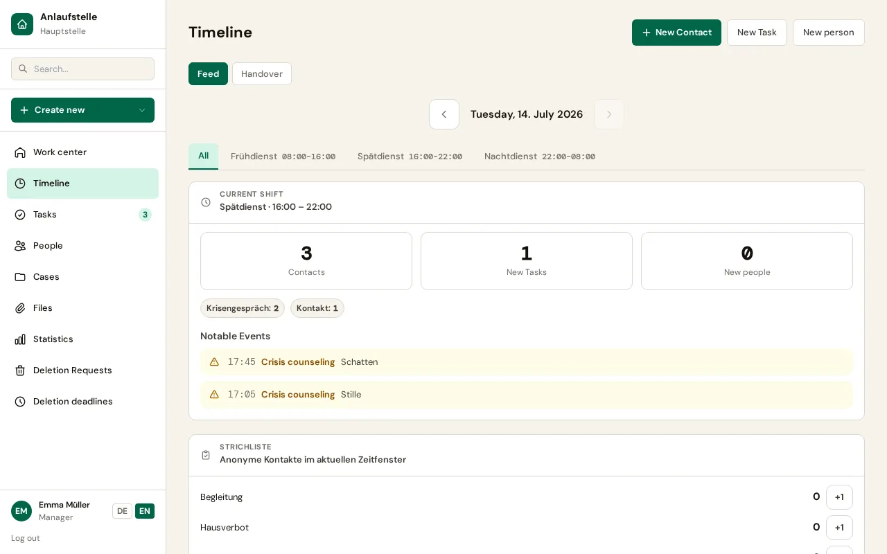

### Log an event
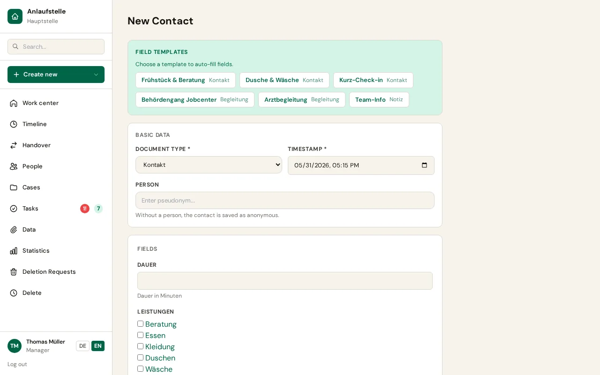

### Client list
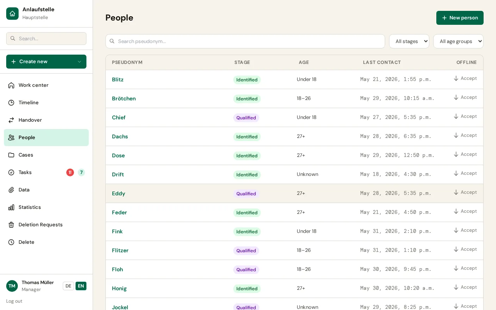

### Client history
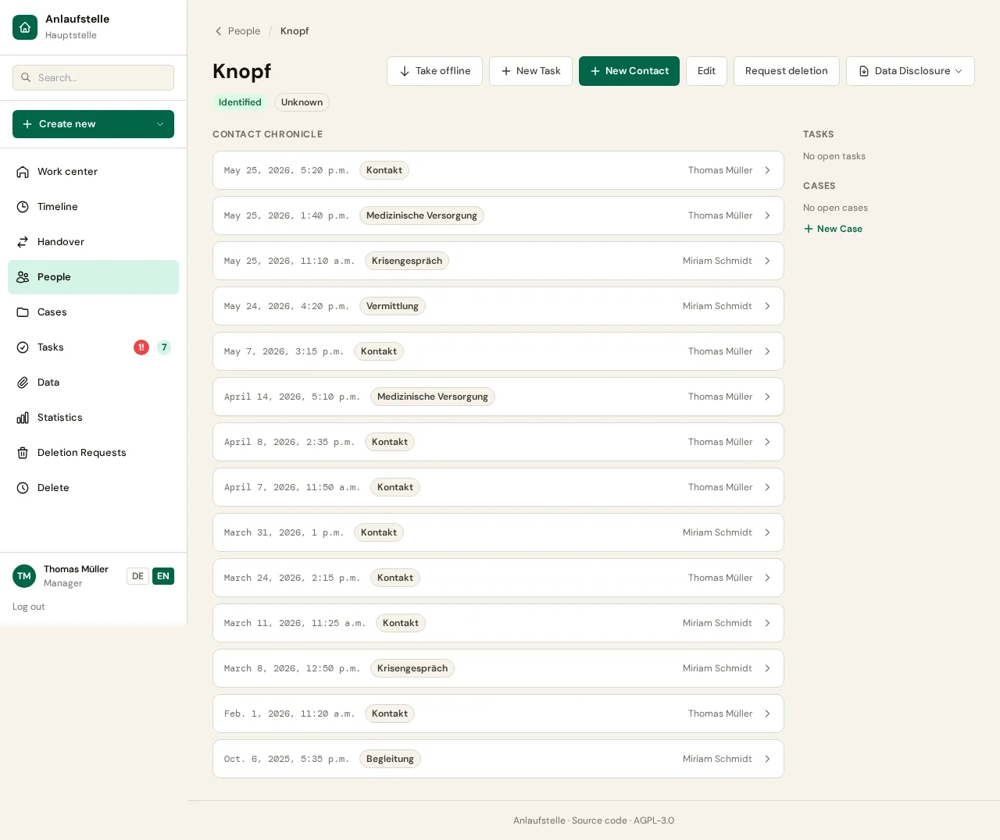

## Case work

### Case file with episodes and goals
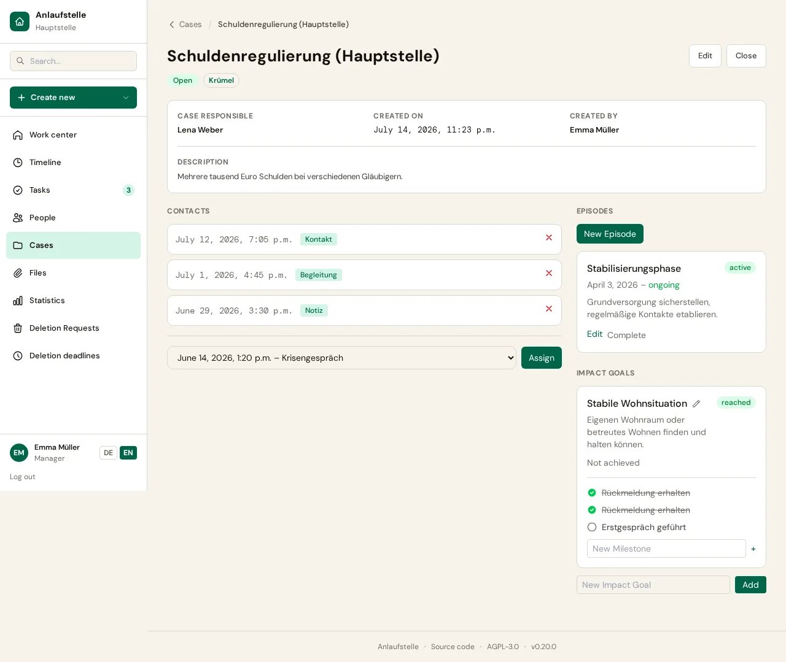

### Shift handover
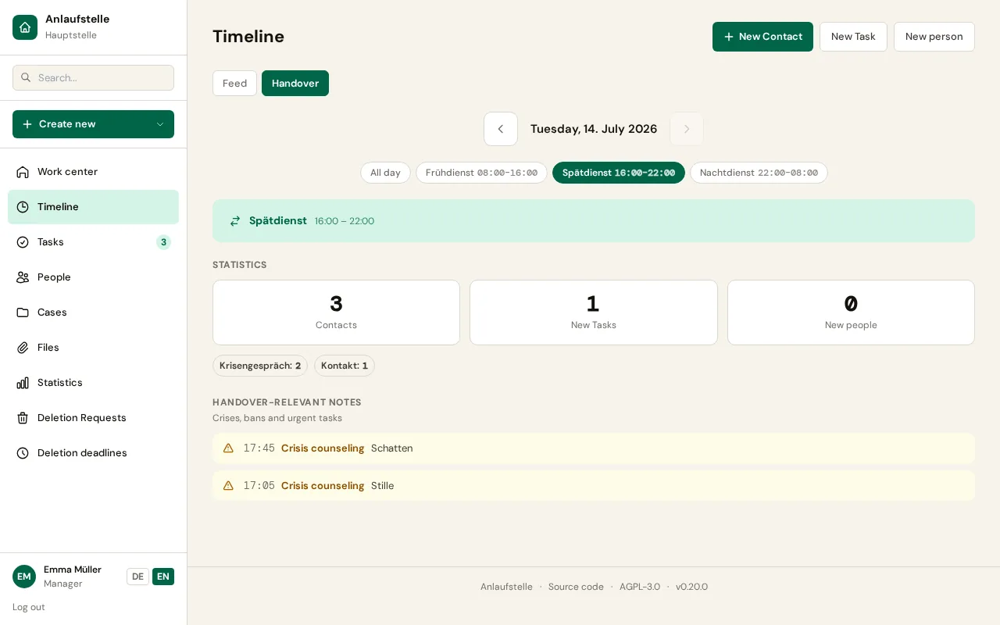

### Work hub — role-based landing
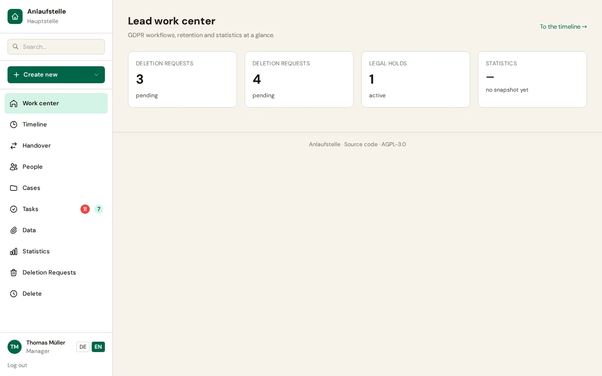

## Reporting & data protection

### Statistics
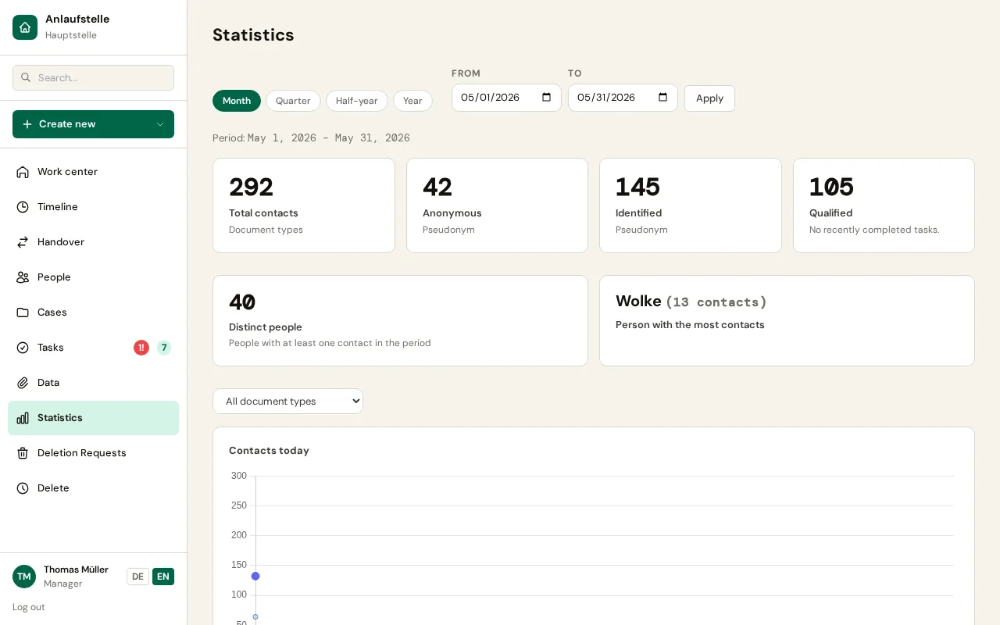

### Privacy-friendly external report
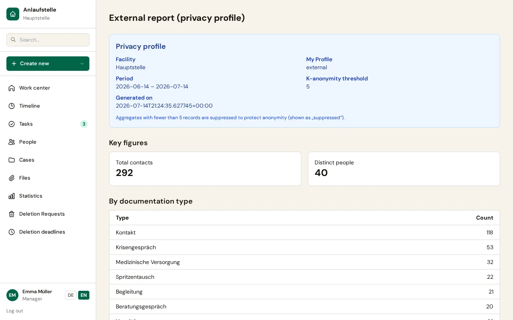

### GDPR data package
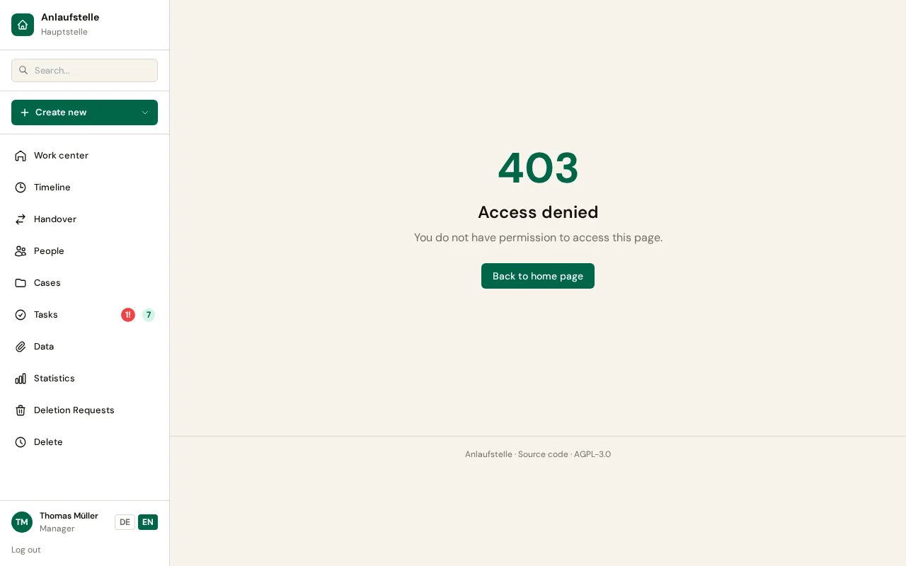

## Access

### Sign in

## Mobile

| Timeline (mobile) | Work hub (mobile) |
|:---:|:---:|
| 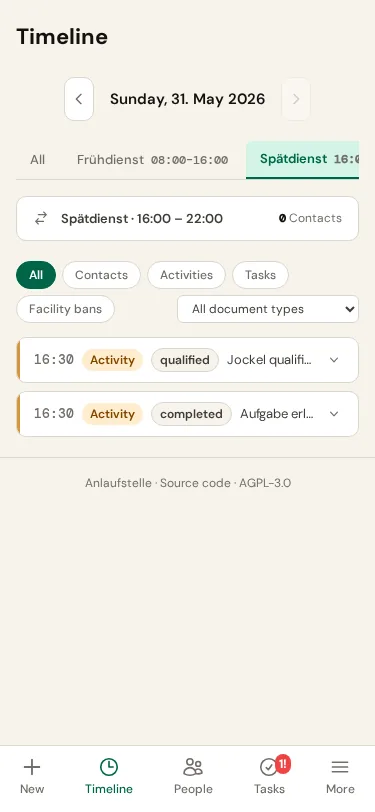 | 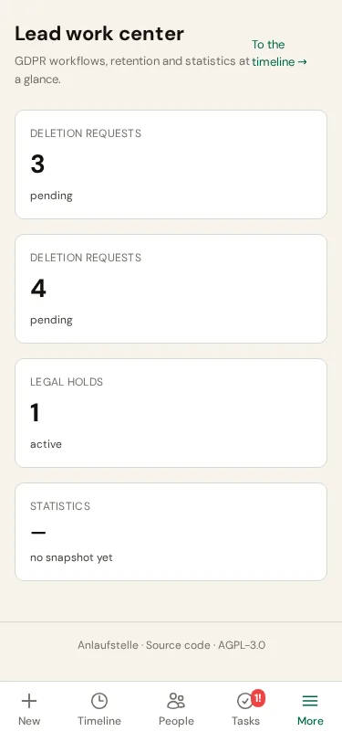 |
