# Screenshots — Anlaufstelle

> **[English version](screenshots.en.md)** · zurück zur [README](../README.md)

Ein vollständiger Rundgang durch Anlaufstelle. Alle Bilder stammen aus der
Demo-Umgebung (`make seed --scale=medium`) und zeigen ausschließlich
pseudonymisierte Beispieldaten.

## Alltag & Dokumentation

### Zeitstrom — das digitale Dienstbuch
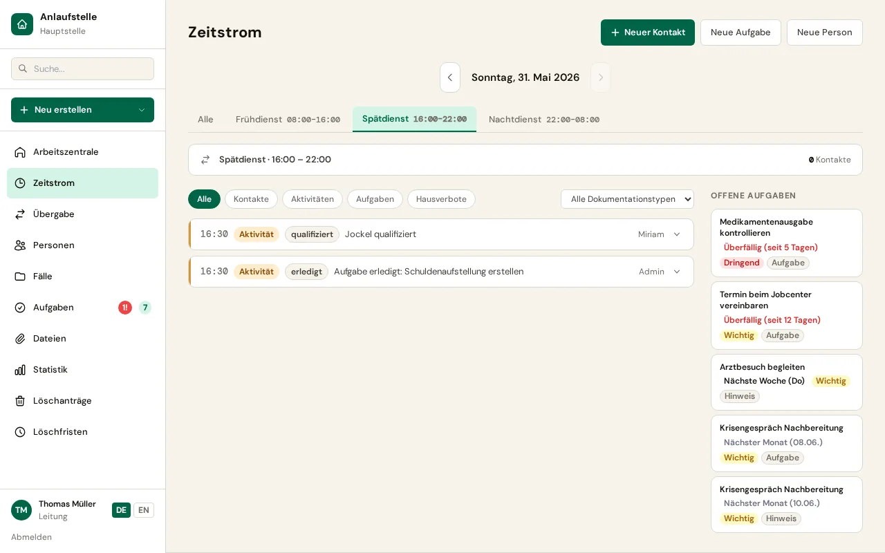

### Ereignis erfassen
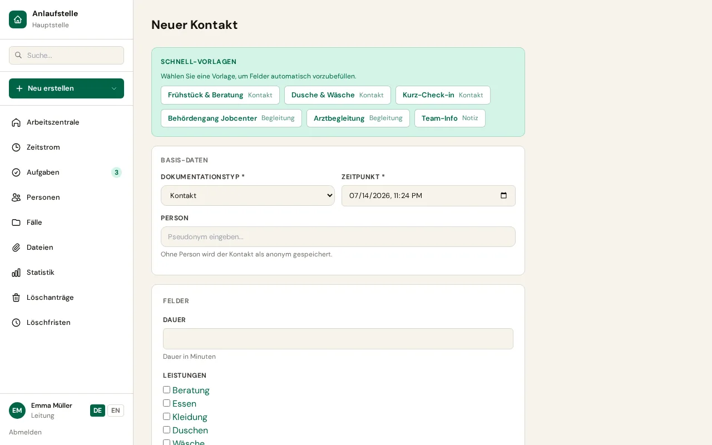

### Personenliste
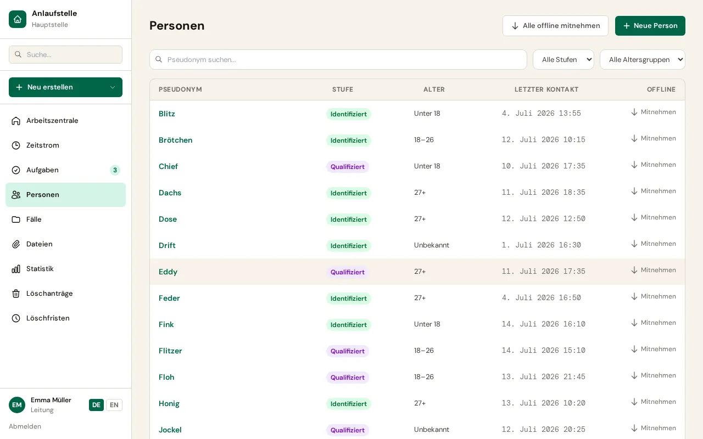

### Personenverlauf
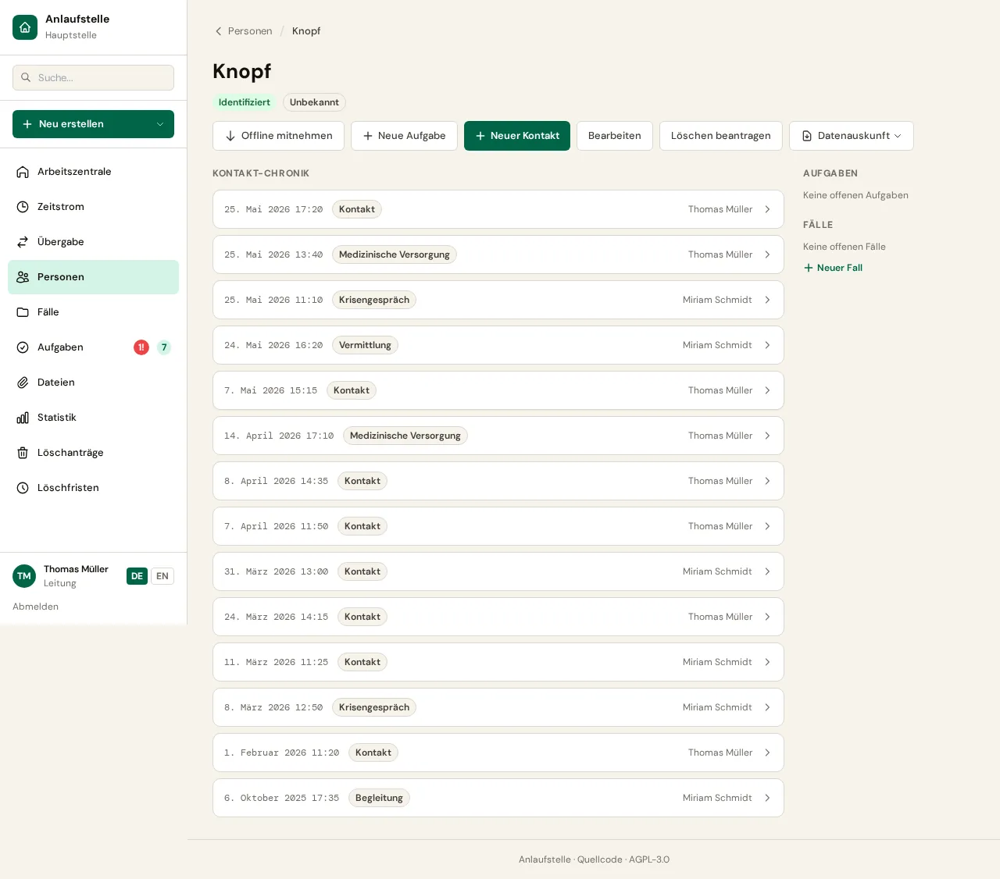

## Fallarbeit

### Fallakte mit Episoden und Zielen
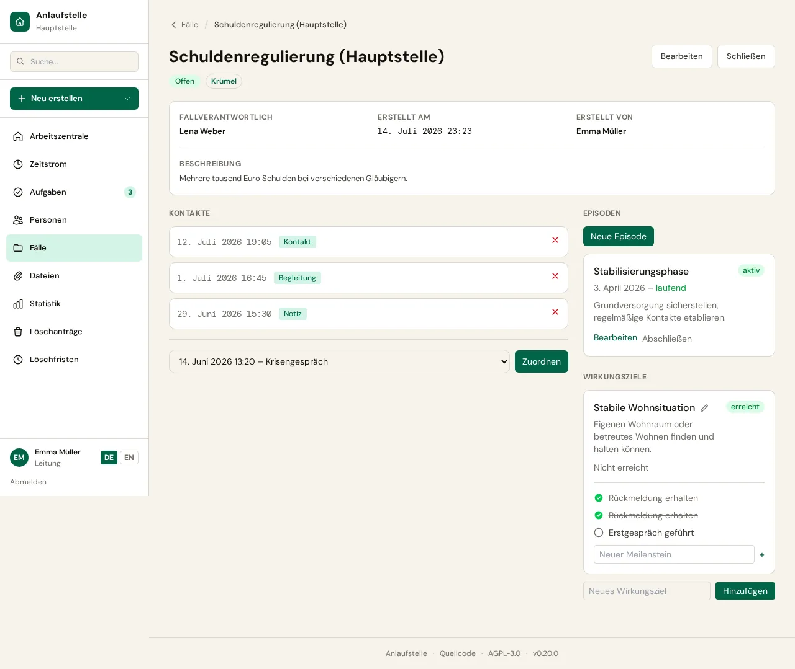

### Schichtübergabe
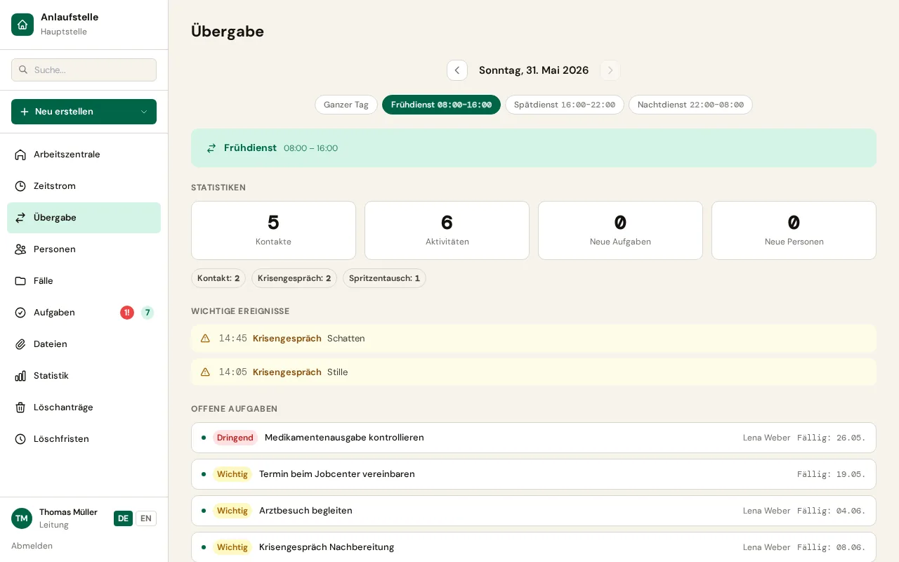

### Arbeitszentrale — rollenbezogener Einstieg
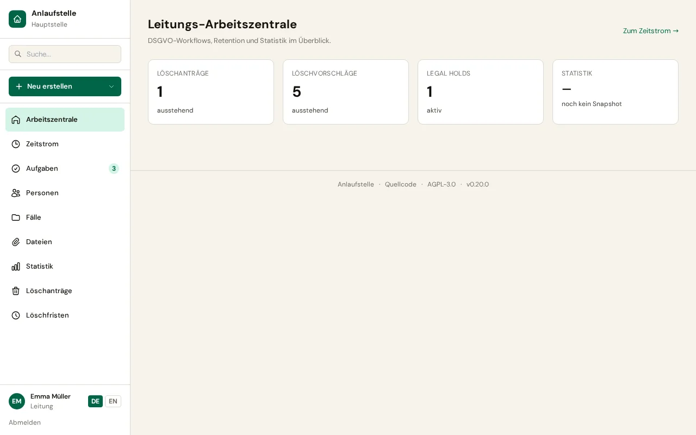

## Auswertung & Datenschutz

### Statistiken
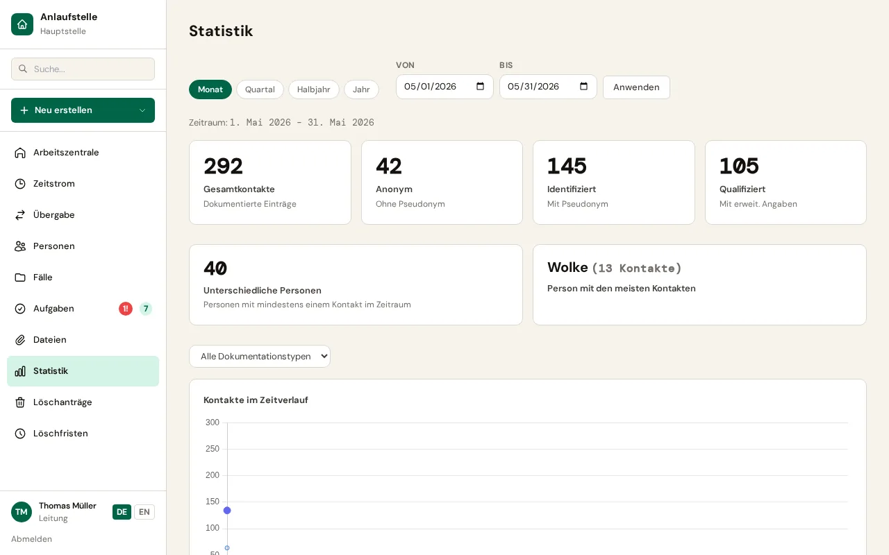

### Datenschutzfreundlicher externer Bericht
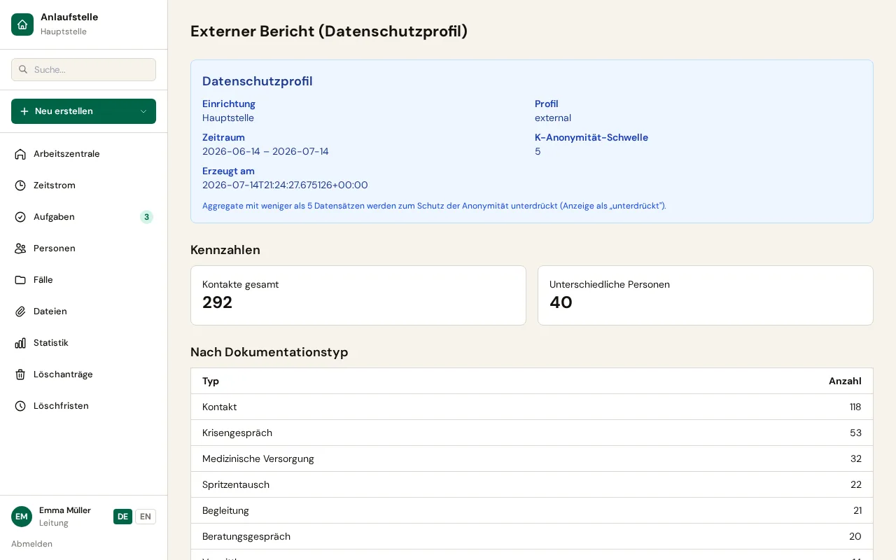

### DSGVO-Datenpaket
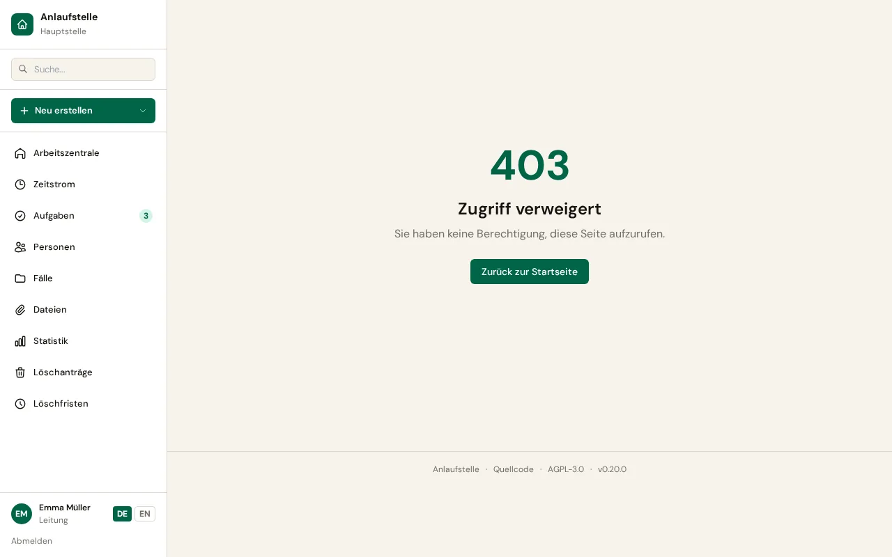

## Zugang

### Anmeldung
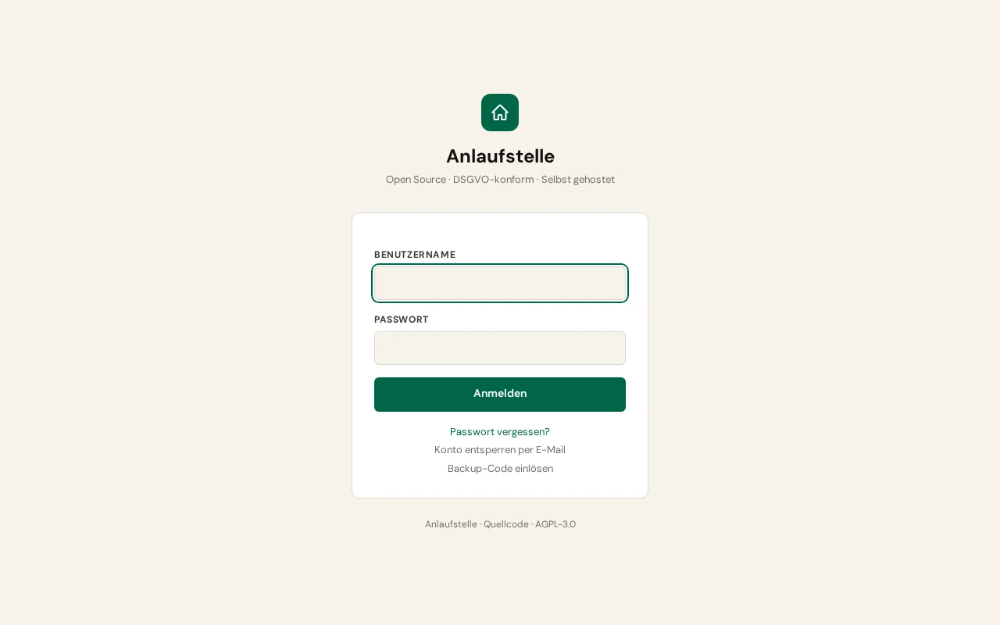

## Mobil

| Zeitstrom (Mobil) | Arbeitszentrale (Mobil) |
|:---:|:---:|
| 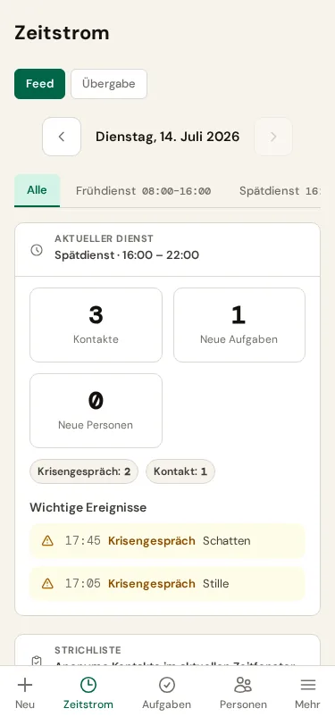 | 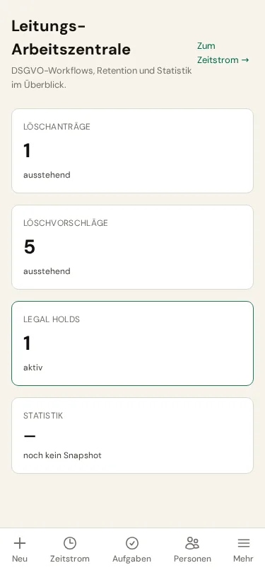 |
